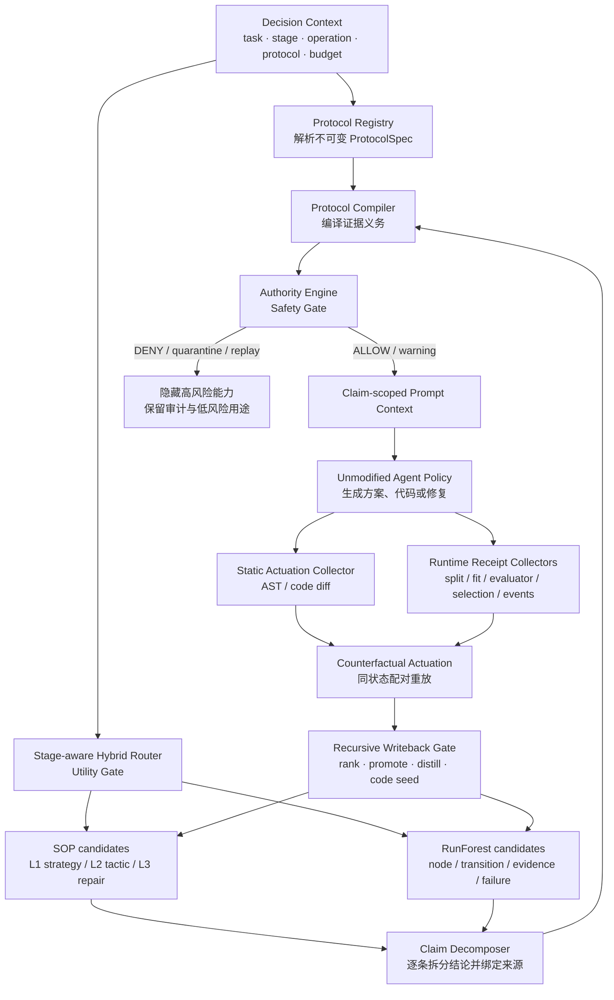

# Decision Admissibility（决策准入性）统一研究与工程说明书

> 工作标题：**When Experience Is Admissible: Decision-Admissible Memory Actuation for Recursive MLE Agents**  
> 方法工作名：**Decision-Admissible Memory Actuation（DAMA，决策准入式记忆驱动）**  
> 文档版本：v0.2，2026-07-18  
> 代码快照：`codex/dual-time-procedural-memory` @ `04870ec49da8ce17d8e150190e9c44509a589412`  
> 本文用途：统一当前代码、LaTeX 论文、汇报 PPT、实验计划与 claim boundary（结论边界）。

## 0. 先说结论

这项工作的最佳主线不是“我做了 Dynamic Hybrid、SOP 和一套协议系统”三个并列模块，而是一个统一问题：

> **一条相关经验只有同时满足两项条件，才有资格驱动当前决策：它的粒度必须匹配当前决策阶段，而且它所表达的具体结论必须拥有在当前协议下影响该操作的证据权限。经验被使用后，系统还必须通过静态、运行时和反事实回执，确认经验确实改变了程序，才能把功劳、分数或权限写回后续记忆。**

可以把整个系统想象成机场的两道登机口和一张到达回执：

1. **Utility Gate（效用门）**检查“你是不是来对了航站楼”。Draft（方案草拟）应该看 L1 方法路线，Debug（调试）才应该看 L3 报错修复。Dynamic Hybrid 负责这一步。
2. **Safety Gate（安全门）**检查“你的票允许你坐这趟航班吗”。同一条经验可以允许 `INSPECT`（查看）和 `DEBUG_HYPOTHESIS`（提出调试假设），但禁止 `RANK`（排名）、`PROMOTE`（晋升）或 `CODE_SEED`（代码种子）。Authority 负责这一步。
3. **Actuation Receipt（采纳回执）**检查“你是否真的抵达，而不只是拿到登机牌”。经验出现在 prompt 中不等于被采用；必须检查 AST/code diff（抽象语法树/代码差异）、运行事件和配对反事实，确认经验真实改变了程序。
4. **Recursive Writeback（递归写回）**检查“这次结果能否成为下一代记忆”。没有获得权限或没有实际采纳证据的经验，不能经过 Summary→SOP→Merged SOP→Code Template 后被洗白。

### 当前成熟度判断

| 维度 | 当前判断 | 解释 |
|---|---:|---|
| 系统架构 | 3.5–4/5 | RunForest、SOP、Stage-aware router、Authority substrate 都已经有真实代码。 |
| 当前方法 novelty | 2–2.5/5 | 多粒度路由、episodic/procedural hybrid、promotion gate 等宽泛机制已有强近邻。 |
| 当前实验证据 | 1.5–2/5 | 主要是 retrospective（回顾性）检索诊断；尚无完整在线采纳、权限阻断和多代污染证据。 |
| 完成本文计划后的潜力 | 3.5–4/5 | 前提是发现并证明非平凡的因果错配规律，以及完整系统在安全—效用 Pareto front（帕累托前沿）上优于强基线。 |

**因此，这可以形成有竞争力的 ICLR system + empirical finding（系统加实证发现）工作，但现在还不能按 ICLR-ready result（可直接投稿的结果）来表述。**

## 1. 本说明书基于的真实资产

### 1.1 LaTeX 论文

- 主文件：`papers/runforest_iclr2025/main.tex`
- 当前 PDF：`papers/runforest_iclr2025/main.pdf`
- Evidence Ledger（证据账本）：`papers/runforest_iclr2025/evidence/claims.md`
- 当前标题：`When Experience Is Eligible: Protocol-Safe Stratified Memory for Self-Improving Machine Learning Agents`

当前论文已经做对三件事：

1. 明确区分 relevance（相关性）与 admissibility（准入性）。
2. 主动承认现有实验是 routing diagnostics（路由诊断），不是 downstream MLE superiority（下游 MLE 优越性）。
3. 建立了逐项证据账本，区分 `supported / diagnostic / smoke-only / rejected / pending`。

但论文目前仍有三个叙事问题：

1. `Decision-stage stratification`、`protocol repair`、`provenance-gated promotion` 看起来仍像三个并列贡献。
2. 公式 `A(e|z)` 仍以整条 experience（经验）为单位，无法表达一条混合价值经验中“局部修复可用、最终分数不可用”。
3. 主实验仍是 120 个 stage episodes 和 38 个 Debug episodes 的回顾性路由测试，尚未直接测量经验是否改变 Agent 的动作、代码、运行或后代记忆。

### 1.2 当前汇报 PPT

- 最新 PPT：`outputs/nautilus_dynamic_hybrid_updated_report.pptx`
- 讲稿：`outputs/nautilus_dynamic_hybrid_汇报稿.md`
- 共 23 页。

当前 PPT 的结构是：

- 第 1–13 页：Run Tree、Transition、SOP、Dynamic Hybrid、离线结果和节点级权限不足。
- 第 14–22 页：Claim Authority、Protocol Registry、Receipt、Replay 和风险映射。
- 第 23 页：当前论文技术主线。

问题不在内容错误，而在状态表达已经落后于代码：第 14–22 页仍统一写成“计划升级”，但现在的真实状态应拆成三类：

- **Implemented substrate（已实现基础设施）**：Claim/Operation/Stage/Protocol 模型、Registry、Compiler、Evidence Graph、Authority Engine、Derivation Guard、Replay Certifier。
- **Wired but shadow（已经接线但仅影子运行）**：ranking、selection、promotion、replay 等 adapter。
- **Missing end-to-end evidence（缺少端到端闭环）**：自动 mixed-claim 拆分、trusted runtime collectors、在线 actuation、enforce 模式、多代污染实验。

### 1.3 当前代码与测试

聚焦测试命令：

```bash
PYTHONPATH=mlevolve .venv/bin/python -m pytest -q \
  tests/authority \
  tests/test_stage_aware_hybrid_memory.py \
  tests/test_causal_granularity_benchmark_v2.py \
  tests/test_protocol_repair.py \
  tests/test_run_forest_memory.py
```

当前结果：

```text
213 passed in 39.64s
```

这证明相关模块的现有单元和集成行为是稳定的，但“测试通过”不等于“论文主张已经得到实验证明”。

## 2. 当前系统到底是什么

当前系统不是传统意义上简单的“长短期记忆”，而是四个不同职责的层：

| 层 | 当前载体 | 保存什么 | 主要用途 |
|---|---|---|---|
| Working Memory（工作记忆） | 当前 branch/context/prompt | 当前任务状态、当前代码、当前错误 | 支持一次决策 |
| Procedural Memory（程序性记忆） | SOP | 抽象的方法路线、策略、战术和修复原则 | 导航和泛化 |
| Episodic Execution-Evidence Memory（情节式执行证据记忆） | RunForest | Run、RunNode、Transition、Evidence、FailurePattern | replay、debug、因果追溯、运行证据 |
| Authority Memory（权限记忆） | Claim/Receipt/Protocol/Decision/Derivation graph | 哪个结论由什么证据支持、可以影响什么操作 | 阻止错误分数和派生洗白 |

### 2.1 SOP 的角色

SOP 是“地图上的路标”：它告诉 Agent 某类问题通常应该采取什么路线，但不天然证明某次操作在当前任务上运行过、有效或符合当前协议。

当前 taxonomy（分类体系）有 281 条 SOP：

- L1 strategy（整体策略）：28 条；
- L2 tactic（实现战术）：101 条；
- L3 repair（具体修复）：152 条。

这套 taxonomy 对严格 stage gate 很有用，但其主要价值是可审计的 ontology/annotation（本体与标注），不应单独作为论文主 novelty。

### 2.2 RunForest 的角色

RunForest 是“带录像和维修单的行车记录”：

- RunNode 记录当时的 plan、code、metric、error 和 audit；
- Transition 记录父节点到子节点具体改变了什么；
- Evidence 记录执行和审计证据；
- FailurePattern 记录失败机制；
- parent/child 边是运行时真实产生的事实关系，不由 LLM 在检索时临时构造。

当前 `run_forest_graph.json` 的完整图快照包含：

| 类型 | 数量 |
|---|---:|
| Run | 29 |
| RunNode | 1,508 |
| Transition | 1,479 |
| SOP | 281 |
| Evidence | 1,360 |
| FailurePattern | 1,208 |
| `distills_to` edges | 2,773 |

论文中的“22 个 allowlisted journals、1,346 RunNodes、1,324 Transitions、1,236 Evidence、787 FailurePatterns”是更严格的 clean corpus（干净语料）统计。两组数字口径不同，论文中必须明确区分“完整图快照”和“进入正向实验的 allowlisted clean corpus”。

### 2.3 Dynamic Hybrid 的角色

Dynamic Hybrid 不是简单地把 SOP 和 Tree 拼起来，而是分两步：

1. **Stage routing（阶段路由）**：不同决策阶段使用不同候选配额、粒度和融合权重。
2. **Debug abstention（调试弃权）**：先对合法的历史修复 Transition 排序，再独立计算 evidence confidence（证据可信度）；低于 0.50 时完全关闭 Tree，回退 SOP-only；Tree 权重最高为 0.60。

这部分已实现于 `mlevolve/agents/memory/stage_aware_hybrid_memory.py`：

- stage quotas：第 25 行附近；
- stage RRF weights：第 33 行附近；
- Debug transition filtering/ranking：第 1,537 行附近；
- confidence gate：第 1,664 行附近；
- full hybrid memory pack：第 1,913 行附近。

最稳妥的论文表述不是“首次提出多粒度动态记忆”，而是：

> 在 MLE Debug 中，系统检索完整的 execution-grounded repair transition（执行落地修复转移），并在没有足够适用证据时显式 abstain（弃权）回到抽象 SOP。

在没有反事实替换和重新执行前，不应把这些 Transition 称为 causal transition（因果转移）。

### 2.4 Authority 的角色

当前 `mlevolve/authority/` 已经实现：

- Claim、Operation、DecisionStage、ProtocolSpec、Receipt、AuthorityDecision 数据模型；
- immutable hash-addressed Protocol Registry（不可变、哈希寻址协议注册表）；
- Protocol Compiler（协议编译器）；
- Evidence Graph（证据图）；
- Authority Engine（权限引擎）；
- Derivation Guard（派生保护器）；
- Replay Certifier（重放认证器）；
- ranking、selection、promotion、replay 和 memory adapter；
- actuation contract 和分级数据结构。

所以这已经不是只有 PPT 的概念设计。但当前主要是 substrate（基础设施），尚未形成 production-closed loop（生产闭环）。

## 3. 统一研究问题：两种不同的“错配”

### 3.1 Granularity mismatch（粒度错配）

当前决策需要的抽象层次与检索到的经验层次不一致。

例子：

- Agent 正在 Draft 阶段选择“Transformer、树模型还是混合模型”；
- 检索器返回了“某个 `torch.load` 路径错误”“batch size 改成 8”“某个 tensor shape 不匹配”；
- 这些内容与任务可能语义相关，也可能来自高分运行，但会把总体路线选择带向过细的局部实现。

这是 Dynamic Hybrid 要解决的 Utility（效用）问题。

### 3.2 Authority mismatch（权限错配）

经验与当前问题高度相关，但它所表达的结论没有资格影响当前操作。

例子：

- 某个程序真实执行并得到 0.92；
- 它也正确修复了 OOF index misalignment（OOF 索引错位）；
- 但它使用 test labels 选择最终模型；
- 因此“代码执行过”和“OOF 修复方式有参考价值”可以成立；
- “0.92 是合法分数”和“该方法优于 baseline”不能成立。

这是 Authority 要解决的 Safety（安全）问题。

### 3.3 为什么必须统一，而不能只做其中一个

只做 Stage routing：

- 能避免 Draft 被 API 报错干扰；
- 但一条粒度正确、相关性很高、分数很高却发生 leakage 的经验，仍会污染排名与晋升。

只做 Authority：

- 能阻止污染分数进入高风险操作；
- 但 Draft 仍可能被大量合法却过细的 Debug 细节挤占上下文和注意力。

因此，研究对象不是“memory item 是否有效”，而是：

> **某条经验中的某个 Claim，在当前 Stage 和 Protocol 下，是否有资格影响某个 Operation。**

### 3.4 Novelty 应该落在哪里

现有文献已经使下面这些宽泛表述很难单独成立为 novelty：

- “不同 stage 检索不同记忆”；
- “组合 episodic memory 与 procedural memory”；
- “成功和失败经验采用 reliability-aware selection”；
- “从执行轨迹提炼可复用修复”；
- “旧 evaluator/protocol 下的分数需要重放”；
- “未经验证的 skill 不应晋升”；
- “派生记忆不应通过摘要扩大权限”。

最危险的近邻分别覆盖了 stage/role routing、hierarchical raw-summary memory、MLE execution feedback、minimal validated repair、evaluator-scoped utility、promotion gate 和 lineage non-escalation。因此论文不能把上述组件罗列后声称组合本身就是新方法。

更可守、也更可证伪的 novelty 候选是四件连在一起的事：

1. **Empirical phenomenon（实证现象）**：在递归 MLE 决策中，错误记忆粒度和错误证据权限会以不同方式改变 Agent；二者存在可测量的主效应或交互效应。
2. **Evaluation unit（评价单元）**：从 item validity（整条记忆是否有效）改成 claim-use pair，即 `Claim × Operation × Stage × Protocol`。
3. **Execution-level link（执行级连接）**：用 static/runtime/counterfactual actuation receipts 把“检索到了”连接到“代码真的改变了”和“运行结果真的改变了”。
4. **Safety–utility result（安全—效用结果）**：在 mixed-value 和 multi-generation 场景中，相比 global bit、version tag 和 lineage gate，在相同安全水平下保留更多合法 Debug 知识。

目标 delta 可以表述为：

> 现有系统通常决定一条记忆是否可见、可靠或可晋升；本工作研究一条可信来源但统计上混合有效的 MLE 经验，其不同 Claim 是否能在不同学习操作中获得不同权限，并通过执行级配对回执测量这些权限实际阻止或保留了哪些后续影响。

这仍是**待实验打开的 novelty claim**。如果错误粒度不改变真实决策，或 global validity bit 已达到相同 IIR–VKR 曲线，就必须主动收窄主张。

## 4. 核心形式化

令：

- \(e\)：一条经验或记忆载体；
- \(c\in C(e)\)：从经验中拆出的原子 Claim（结论）；
- \(q\)：当前查询；
- \(s\)：Decision Stage（决策阶段）；
- \(o\)：Operation（将被影响的操作）；
- \(P\)：当前 Protocol Version（协议版本）；
- \(z=(q,s,o,P,t,b)\)：完整 Decision Context，其中 \(t\) 是任务，\(b\) 是预算和环境。

### 4.1 相关性不等于准入性

检索器先产生相关性排序：

\[
r(e\mid q).
\]

Stage-granularity gate（阶段—粒度门）判断：

\[
G(e,s)\in\{0,1\}.
\]

Claim authority gate（结论权限门）判断：

\[
H(c,o,s,P)\in
\{\text{ALLOW},\text{ALLOW\_WITH\_WARNING},\text{DENY},
\text{QUARANTINE},\text{REQUIRE\_REPLAY}\}.
\]

一条 Claim 在动作发生前的准入条件是：

\[
D_{\mathrm{pre}}(c,e\mid z)=
\mathbf{1}[G(e,s)=1]\cdot
\mathbf{1}[H(c,o,s,P)\in\mathcal{A}_o],
\]

其中低风险操作的允许集合 \(\mathcal{A}_o\) 可以包含 `ALLOW_WITH_WARNING`，高风险操作通常只接受 `ALLOW`。

被准入后的有效排序为：

\[
\tilde r(c,e\mid z)=r(e\mid q)D_{\mathrm{pre}}(c,e\mid z).
\]

重要点：Authority 不需要重新发明一个 relevance scorer。它保留原始排序，只取消无权影响当前操作的 Claim 的 actuation capability（驱动能力）。

### 4.2 准入不等于实际采纳

动作生成后，还要检查经验是否真实改变程序：

\[
X(c,e,a)=I_{\mathrm{static}}I_{\mathrm{runtime}},
\]

其中：

- \(I_{\mathrm{static}}\)：代码差异满足 MustPreserve/MustChange/MustNotUse；
- \(I_{\mathrm{runtime}}\)：运行时出现 ExpectedRuntimeObservations。

只有需要声称 causal attribution（因果归因）时，再要求：

\[
X_{\mathrm{causal}}=X I_{\mathrm{counterfactual}}.
\]

最后，只有通过协议审计且实际采纳的结果，才有资格获得 credit/writeback（功劳归属与写回）：

\[
W(c,e,a)=D_{\mathrm{pre}}\cdot X\cdot I_{\mathrm{protocol\ clean}}.
\]

这三个公式分别回答：

1. 可以被看到和驱动吗？
2. 真的被采用了吗？
3. 采用结果可以被晋升和蒸馏吗？

## 5. 统一系统架构



### 5.1 系统中的 LLM 到底负责什么

LLM 可以参与，但不能成为最终安全裁判。

| 工作 | LLM 可以做什么 | 机器必须做什么 |
|---|---|---|
| Claim 拆分 | 提议自然语言中有哪些原子结论 | 将每个 Claim 绑定到具体 artifact、代码片段、metric 和来源运行；无法绑定则拒绝 |
| SOP 生成 | 总结 action、conditions、failure 和 expected effect | 保存 clause-level parent claims；检查派生 scope 不扩张 |
| Gateway 选择 | 在通过硬门的候选 ID 中重排 | 先执行 stage、task、protocol 和 authority 硬门 |
| Experience Contract | 提议 MustPreserve/MustChange/MustNotUse | AST 和 runtime collector 验证是否真正满足 |
| Debug 假设 | 使用带警告的无效经验提出假设 | 禁止把其 score 用于 rank/promote |
| 最终授权 | 不负责 | Authority Engine 根据 ProtocolSpec 和 trusted receipts 决定 |

最重要的原则是：

> **LLM 负责解释和提议；宿主系统负责绑定、采证、核验和授权。**

## 6. 数据模型设计

### 6.1 DecisionContext（决策上下文）

```yaml
decision_id: dec_...
task:
  task_id: leaf_classification
  family: classification
stage: debug
operation: repair_seed
protocol_ref: leaf-classification@v3#sha256...
budget:
  token_budget: 6500
  gpu_hours_remaining: 4
agent:
  model: fixed-backbone-id
  temperature: 0
```

它必须成为 router 和 Authority 的共同输入，避免两套模块各自解释“当前阶段”。

### 6.2 MemoryArtifact（记忆载体）

```yaml
artifact_id: transition:run17:node8->node9
carrier: runforest_transition  # sop | run_node | transition | summary | template
abstraction_level: L3
decision_tags: [debug, repair]
source_refs: [run17, node8, node9, evidence42]
content_ref: artifacts/...
claim_refs: [claim_exec_1, claim_repair_1, claim_score_1]
derivation_refs: []
```

Artifact 是“装结论的容器”，不能再把整个 Artifact 直接等同于一个 valid bit（有效位）。

### 6.3 Claim（结论）

当前代码已经有：

- `EXECUTED`
- `SCORE`
- `PAIRWISE_SUPERIORITY`
- `CAUSAL_ATTRIBUTION`
- `GENERALIZATION`

建议新增正式类型：

- `DEBUG_REPAIR`：失败父节点经过某个代码变化后，成功子节点完成执行；只表示 execution-grounded repair fact（执行落地修复事实），不自动表示因果性。
- 可选 `METHOD_HYPOTHESIS`：某种方法路线值得尝试；用于 Draft，不携带 score superiority。

示例：

```yaml
claim_id: claim_repair_oof_index_001
claim_type: DEBUG_REPAIR
subject_artifact_id: transition:node8->node9
statement: "Resetting and rejoining OOF indices removed the observed misalignment failure."
task_scope:
  family: tabular_classification
method_fingerprint: sha256...
protocol_ref: task-x@v3#sha256...
evidence_refs:
  - parent_failure_receipt
  - code_diff_receipt
  - child_execution_receipt
parent_claims: []
```

### 6.4 Receipt（证据回执）

Receipt 不是 LLM 的主观评分，而是 host-owned collector（宿主侧受信任采集器）签发的机器事实：

```yaml
receipt_id: receipt_fit_scope_...
receipt_type: FIT_SCOPE
artifact_id: node9
run_id: run17
protocol_hash: sha256...
collector_id: host.fit_scope.v1
collector_version: "1"
payload_hash: sha256...
payload:
  component: tfidf_vectorizer
  fit_sample_ids_hash: sha256...
  allowed_train_ids_hash: sha256...
  forbidden_overlap_count: 0
timestamp: ...
event_hash: ...
```

Receipt 应采用 append-only（只追加）和 hash chain（哈希链）保存，不能在发现错误后回头修改旧记录。

### 6.5 AuthorityRequest / AuthorityDecision

```yaml
request:
  artifact_id: node9
  claim_id: claim_score_001
  operation: rank
  decision_stage: branch_selection
  active_protocol: task-x@v3#sha256...
  requesting_component: engine.solution_manager

decision:
  outcome: DENY
  satisfied_paths: [path_exec]
  missing_obligations: [FIT_SCOPE, SELECTION_FREEZE]
  blocking_receipts: [receipt_test_label_selection]
  required_action: "method-preserving clean replay"
  policy_version: authority_v2
```

### 6.6 ExperienceContract（经验采纳合同）

一条经验进入 Agent 前，应被编译成可检查合同：

```yaml
experience_id: exp_oof_index_fix
preconditions:
  - failure_signature == oof_index_misalignment
must_preserve:
  - model_family
  - feature_family
  - training_objective
must_change:
  - oof_index_alignment == explicit_original_index
must_not_use:
  - test_labels_for_model_selection
  - holdout_for_threshold_tuning
expected_runtime_observations:
  - every_outer_train_row_predicted_exactly_once
  - prediction_row_id_matches_source_row_id
  - final_holdout_evaluated_after_selection_freeze
```

合同把“请参考这条经验”转成“哪些东西必须保持、必须改变、绝不能使用、运行时必须观察到什么”。

### 6.7 DerivationEdge（派生边）

建议拆开当前过载的 `distills_to`：

1. `evidence_attached_to`：弱语义或导航关系；允许 inspect/debug，但必须携带 quarantine warning，不获得高风险权限。
2. `authorized_distills_to`：已经通过 parent claim、scope、protocol、actuation 和 derivation 检查的权威蒸馏关系；才允许支撑 rank/promote/code-seed。

```yaml
edge_id: derivation_001
kind: authorized_distills_to
parent_claim_refs: [claim_repair_001]
child_claim_refs: [claim_sop_repair_017]
relation: abstracts_without_scope_widening
authority_outcome: allow
receipt_refs:
  - derivation_clause_map_receipt
  - runtime_actuation_receipt
  - counterfactual_actuation_receipt
```

## 7. Claim-specific Authority（结论特定权限）

### 7.1 混合价值经验的标准案例

经验 E 同时包含：

1. 正确修复 OOF index misalignment；
2. 代码真实执行成功；
3. 使用 test labels 选择最佳模型；
4. 输出 0.92 并声称优于 baseline。

系统不应对整个 E 设置一个 `valid=true/false`，而应拆成：

| Claim | 真实含义 | 可支持的操作 | 被禁止的操作 |
|---|---|---|---|
| C1 `EXECUTED` | 代码确实运行过 | INSPECT | 不能单独支持 RANK/PROMOTE |
| C2 `DEBUG_REPAIR` | OOF 索引修复后错误消失 | DEBUG_HYPOTHESIS、受约束 REPAIR_SEED | 不能直接证明分数合法或方法更优 |
| C3 `SCORE` | 运行报告 0.92 | 作为带警告的历史事实查看 | RANK、SELECT、PROMOTE |
| C4 `PAIRWISE_SUPERIORITY` | 方法优于 baseline | 无，证据不足 | RANK、SELECT、PROMOTE、DISTILL |
| C5 `CAUSAL_ATTRIBUTION` | OOF 修复导致性能提高 | 无，缺反事实 | 任何因果蒸馏或因果表述 |

正确输出应类似：

```text
INSPECT(EXECUTED): ALLOW
DEBUG_HYPOTHESIS(DEBUG_REPAIR): ALLOW_WITH_WARNING
REPAIR_SEED(DEBUG_REPAIR): ALLOW_WITH_WARNING + method contract
RANK(SCORE): DENY
SELECT(PAIRWISE_SUPERIORITY): DENY
PROMOTE(SCORE): QUARANTINE
CODE_SEED(whole_program): DENY
```

这里的关键优势不是“更严格”，而是：

> **在安全阻断无效分数的同时，保留合法的 Debug 知识。**

这必须用 Valid Knowledge Retention（有效知识保留率）和 Invalid Influence Rate（无效影响率）的联合曲线来证明。

### 7.2 Claim × Operation × Stage × Protocol 权限矩阵

下面是推荐的默认矩阵；具体任务差异由 ProtocolSpec 配置，不写死在 Python `if/else` 中。

| Claim | Operation | Stage | 基础义务 | 默认结果 |
|---|---|---|---|---|
| EXECUTED | INSPECT | 任意 | CODE_EXECUTION | ALLOW |
| DEBUG_REPAIR | DEBUG_HYPOTHESIS | DEBUG | parent failure + code diff + child execution | ALLOW/ALLOW_WITH_WARNING |
| DEBUG_REPAIR | REPAIR_SEED | DEBUG/REPLAY | METHOD_IDENTITY + contract | ALLOW_WITH_WARNING |
| SCORE | RANK | BRANCH_SELECTION | execution + split + fit + evaluator + selection freeze + protocol match | 仅全满足时 ALLOW |
| PAIRWISE_SUPERIORITY | SELECT | BRANCH_SELECTION | SCORE 全部义务 + paired seeds + aggregation + replication | 仅全满足时 ALLOW |
| GENERALIZATION | PROMOTE | MEMORY_WRITEBACK | 多任务/多域 replication + clean ancestry | 仅全满足时 ALLOW |
| DEBUG_REPAIR | DISTILL | DISTILLATION | clause lineage + non-widening scope + runtime actuation | 仅全满足时 ALLOW |
| CAUSAL_ATTRIBUTION | DISTILL | DISTILLATION | runtime + counterfactual actuation + positive clean effect | 仅全满足时 ALLOW |
| 任意污染 Claim | INSPECT | 任意 | 保留 provenance warning | ALLOW_WITH_WARNING |
| 旧协议合法 SCORE | RANK | 新协议 | compatibility 或 clean replay | REQUIRE_REPLAY |

## 8. Protocol Registry（协议注册表）

### 8.1 为什么它不是一堆写死规则

Authority Kernel（权限内核）只负责通用逻辑：

- 找到当前 Claim；
- 根据 Claim、Operation、Stage 和 Protocol 编译义务；
- 检查完整证据路径；
- 输出 ALLOW/DENY/REQUIRE_REPLAY；
- 禁止派生权限扩大。

具体任务规则放在 ProtocolSpec 中，以 Rules as Data（规则数据化）表达：

- 任务是 classification、regression 还是 ranking；
- 独立样本是什么；
- 是否按 patient/group/query/time 切分；
- metric 名称与方向；
- 是否允许 transductive preprocessing；
- seed 数量和聚合方式；
- holdout 可评估次数；
- 什么证据足以支持方法优越性。

### 8.2 当前实现与目标差距

当前只有：

```text
mlevolve-default@1
```

它证明 Registry/Spec/Hash 接口存在，但不能证明 Authority Kernel 跨任务普适。主实验前至少增加三类：

```yaml
protocol_id: grouped_classification
version: v1
task_profile:
  objective: classification
  unit_of_analysis: entity
data_split_policy:
  family: group_stratified
  group_key: configured_by_task
  forbidden_overlap: [group_key]
metric_spec:
  name: macro_f1
  direction: maximize
selection_policy:
  evidence_source: outer_train_oof
seed_policy:
  seeds: [1, 2, 3, 4, 5]
  aggregation: mean
holdout_policy:
  terminal_only: true
  maximum_evaluations: 1
```

```yaml
protocol_id: chronological_regression
version: v1
task_profile:
  objective: regression
  unit_of_analysis: timestamp
data_split_policy:
  family: chronological
  future_must_not_train_past: true
metric_spec:
  name: rmse
  direction: minimize
selection_policy:
  evidence_source: rolling_validation
holdout_policy:
  terminal_only: true
```

```yaml
protocol_id: grouped_ranking
version: v1
task_profile:
  objective: ranking
  unit_of_analysis: query
data_split_policy:
  family: query_group
  forbidden_overlap: [query_id]
metric_spec:
  name: ndcg_at_10
  direction: maximize
selection_policy:
  evidence_source: query_group_oof
```

三类任务切换时只能新增或切换 ProtocolSpec，不能修改 Authority Engine 的核心控制流。这个实验才真正证明 Rules as Data，而不是 task-specific rules（任务特定规则）的包装。

### 8.3 版本兼容和 replay

Protocol Registry 必须保存：

- current/deprecated（当前/废弃）状态；
- parent version；
- canonical hash；
- compatibility rules；
- 变更原因；
- 哪类 Claim 可以直接迁移，哪类必须 replay。

例子：v2 使用 group split + accuracy，v3 使用 group split + macro-F1。

- v2 的模型结构建议可以用于 Draft；
- v2 的错误过程可以用于 Debug；
- v2 的 accuracy score 不能直接与 v3 的 macro-F1 候选排名；
- 要恢复 SCORE/RANK 权限，必须在 v3 下执行 method-preserving clean replay（保持方法的干净重放）。

## 9. Trusted Receipt Collectors（受信任回执采集器）

当前 `receipt_bridge.py` 主要把 aggregate leakage audit（聚合泄漏审计）翻译成 typed receipts。这对接口集成有用，但论文不能把“由同一份审计结果推导出五种 receipt”当作五份独立可信证据。

目标设计是由宿主在事件实际发生处签发：

| Receipt | 采集位置 | 关键 payload | 能发现什么 |
|---|---|---|---|
| CODE_EXECUTION | executor 进程 | code hash、exit code、runtime、artifact hashes | 代码是否真实执行 |
| SPLIT_LINEAGE | split API wrapper | train/val/test sample-ID hashes、group/time overlap | 数据泄漏、错误切分 |
| FIT_SCOPE | fit/fit_transform wrapper | component、fit sample IDs、allowed scope | scaler/vectorizer 在全数据拟合 |
| PREDICTION_SCOPE | predict wrapper | model train scope、prediction sample IDs | OOF 自训练预测、错误预测范围 |
| EVALUATOR | immutable evaluator host | evaluator hash、input hashes、metric、direction | metric 篡改、样本删除、输入顺序错误 |
| SELECTION_FREEZE | selection controller | candidate set、selection evidence、freeze time | holdout 反复选择、selection bias |
| SEED_AGGREGATION | experiment controller | preregistered seeds、全量结果、aggregation | 只保留最好 seed |
| METHOD_IDENTITY | AST + protected component registry | model、feature、loss、optimizer、budget fingerprint | fake replay 改了方法 |
| STATIC_ACTUATION | post-generation AST diff | MustPreserve/MustChange/MustNotUse 结果 | 经验是否体现在代码中 |
| RUNTIME_ACTUATION | instrumented execution | expected events 与实际事件 | 代码改了但没有走到目标路径 |
| COUNTERFACTUAL_ACTUATION | paired replay harness | memory-on/off action/code/outcome difference | 经验是否实际影响决策 |
| DERIVATION | distiller | clause-level parent mapping、omissions、scope | Summary/SOP 洗白和权限扩张 |

所有 collector 必须：

1. 在 Agent 生成代码之外运行；
2. 记录 collector ID 和版本；
3. 绑定 code/artifact/protocol hash；
4. fail closed（证据缺失时拒绝高风险权限）；
5. 支持独立复核和重放。

## 10. Runtime Actuation Receipts（运行时采纳回执）

### 10.1 为什么 adoption tracking 还不够

当前 adoption tracking 主要观察：

```text
prompt exposure → 文本或代码中是否出现相似内容
```

这只能说明相关性，不能说明：

- 哪个具体 Claim 被采用；
- 是否保持了原方法；
- 是否真的执行了目标修改；
- 是否因为该经验而修改；
- 修改是否带来协议合法的结果。

当前报告的真实边界是：

- 4 个 candidates；
- 只有 1 个 non-mock candidate；
- 0 个完整四条件 episode；
- `adoption_claim_allowed=false`。

Pilot 虽补齐一个 episode 的 F00/F01/F10/F11，但仍被以下条件阻断：

- 只有一个 episode；
- 没有 human adjudication（人工裁决）；
- test episode 已被 pilot 消耗。

它只能作为 harness smoke test（实验框架冒烟测试），不能进入论文主结果。

### 10.2 推荐的采纳等级

| Level | 名称 | 判定 |
|---:|---|---|
| L0 | EXPOSED | 经验进入 prompt/context |
| L1 | CLAIMED_ADOPTION | Agent 声称使用了经验 |
| L2 | STATIC_CONFORMANT | AST/code diff 满足合同 |
| L3 | RUNTIME_CONFORMANT | 目标代码路径执行并产生预期运行事件 |
| L4 | CAUSAL_CONFIRMED | memory-on/off 配对重放显示该经验改变了动作或实现 |
| L5 | EFFECTIVE | 该改变产生协议合法的目标结果 |

论文中的“adoption”至少应报告 L2 和 L3；使用“causal adoption”必须达到 L4；使用“effective repair”必须达到 L5。

### 10.3 两种反事实必须区分

1. **Influence counterfactual（影响反事实）**：同一个 Decision Context 下，保留或移除某条经验，Agent 的结构化动作/代码是否改变？
2. **Efficacy counterfactual（效能反事实）**：采用该修改与不采用该修改重新执行，协议合法的运行结果是否改变？

前者证明“经验影响了 Agent”，后者才接近“经验导致结果变化”。两者不能用一个 lexical overlap（文本重合）代替。

## 11. Recursive Writeback（递归写回）与防洗白

### 11.1 核心不变量

派生 Claim 的权限不能超过其全部必要父 Claim 的权限交集：

\[
Scope(c_{child})\subseteq\bigcap_{p\in Parents(c_{child})}Scope(p).
\]

自然语言改写、摘要、合并、重复引用或多个污染来源相互“佐证”都不能扩大权限。

### 11.2 多代派生链

主实验应构造：

```text
Polluted Run
→ Summary
→ SOP
→ Merged SOP
→ Code Template
→ Descendant Run
```

每一代都要求输出：

- 输入 parent claims；
- 输出 child claims；
- clause-level mapping；
- omitted claims；
- scope change；
- authority decision；
- 是否进入 rank/promote/distill/code-seed。

### 11.3 当前代码中的直接 blocker

当前图中 2,773/2,773 条 `distills_to` 边均为：

```text
authority_outcome = quarantine
authority_reasons =
  - missing_runtime_actuation
  - missing_counterfactual_actuation
```

但 `stage_aware_hybrid_memory.py` 构建 reverse index（反向索引）时仍消费全部 `distills_to` 边，没有检查 outcome。

这意味着 builder 说“没有权限”，retriever 却仍把这些边当 gateway/projection 使用。若不先修复，论文不能声称系统已经阻止 Derived Memory Laundering（派生记忆洗白）。

正确修复不是简单删除所有边，而是：

- 将无权威边保留为 `evidence_attached_to`，仅用于 inspect/debug 导航并显示警告；
- 只有 outcome 为 `allow/allow_with_warning` 且 scope 合法的边，进入 `authorized_distills_to` 高风险索引；
- 在补齐真实 actuation receipts 前，不允许 quarantine 边支撑 rank/promote/code-seed。

### 11.4 Clean Replay（干净重放）

旧污染历史永远保留，Clean Replay 不能把旧 Claim 原地改成 valid。

正确过程：

1. 冻结 source method fingerprint；
2. 只允许修改 ProtocolSpec 声明的 repair surface；
3. 在新协议下重跑；
4. 宿主 collector 产生新 receipts；
5. 新建 support path；
6. 只恢复新证据真实支持的 Claim 权限。

如果 replay 同时更换模型、特征、loss、搜索空间或训练目标：

- `ReplayIdentity = SUCCESSOR_METHOD`；
- 新建 Successor Claim（后继结论）；
- 禁止把新结果用于恢复旧方法的权限。

## 12. 当前实现状态表

| 模块 | 关键文件 | 当前状态 | 论文可说什么 | 还缺什么 |
|---|---|---|---|---|
| RunForest | `paper-skills/hyper_memory/build_run_forest_memory.py`、graph artifact | 已实现 | 保存真实运行结构和来源证据 | 边不天然是 causal；需授权消费 |
| SOP taxonomy | taxonomy builder/artifact | 已实现 | 281 条 L1/L2/L3 可审计标注 | 跨任务 taxonomy 稳定性 |
| Stage-aware routing | `stage_aware_hybrid_memory.py` | 已实现 | 分阶段候选、配额和融合 | 需在线证明错误粒度真的伤害决策 |
| Debug abstention | 同上 | 已实现 | 低 confidence 回退 SOP-only | 目前只是 retrospective silver benchmark |
| Authority models | `authority/models.py` | 已实现 | 有 Claim/Operation/Stage/Receipt schema | 缺 DEBUG_REPAIR；stage ontology 未统一 |
| Protocol Registry | `protocol_registry.py` | 已实现接口 | 不可变、hash-addressed 版本 | 只有一个粗 ProtocolSpec |
| Protocol Compiler | `protocol_compiler.py` | 已实现 | Claim/Operation 编译 receipts | 需 task-family protocols 和新 Claim rules |
| Evidence Graph/Engine | `evidence_graph.py`、`authority_engine.py` | 已实现 | path-level evidence authorization | 需真实 trusted collectors |
| Ranking/selection/promotion adapters | `authority/adapters/mlevolve/` | 已接线 | 可以记录 shadow decisions | 默认 shadow，不改变 legacy behavior |
| Claim adapter | `node_adapter.py` | 部分实现 | 自动创建 SCORE Claim | 未自动拆 EXECUTED/DEBUG_REPAIR/PAIRWISE 等 |
| Replay certification | `replay_certifier.py` | 已实现 | 可区分 method-preserved/successor | 需在线 replay benchmark |
| Derivation guard | `derivation_guard.py` | 已实现 | scope non-escalation、actuation obligation | retriever 未执行 quarantine outcome |
| Receipt bridge | `receipt_bridge.py` | 部分实现 | typed receipt 接口贯通 | 多数是 aggregate audit 翻译，不是独立采集 |
| Actuation model | `actuation.py` | 数据结构已实现 | 有层级和 ExperienceContract | `enable_causal_actuation=false`，未接在线路径 |
| Global memory enforce | `global_memory.py` | 有缺陷 | 有 protocol/ref 过滤 | 未检查 referenced decision 是否真为 ALLOW |
| Multi-task Registry | `config/protocols/` | 未完成 | — | classification/regression/ranking 至少三类 |
| Multi-generation experiment | 尚无完整 artifact | 未完成 | — | 3–5 代污染和合法知识保留 |

### 12.1 配置的真实状态

Base config 当前是：

```yaml
evaluation_authority:
  mode: shadow
  enable_causal_actuation: false

adoption_tracking:
  enable: false

external_skill_memory:
  enable: false
```

专用 `config_run_forest_stage_hybrid.yaml` 会开启 memory 和 adoption tracking，但仍继承 Authority shadow 与 actuation false。

因此，当前真实 online runs 不能作为“完整 Decision Admissibility 已在 enforce 模式提升性能”的证据。

### 12.2 Stage ontology（阶段本体）不一致

Dynamic Hybrid 使用：

```text
draft / improve / debug / evolution / fusion
```

Authority `DecisionStage` 当前使用：

```text
retrieval / draft / debug / branch_selection / fusion /
memory_writeback / distillation / replay
```

必须建立统一 `StageOntology` 和显式映射，否则同一次 `improve` 决策可能在 router 和 Authority 中拥有不同含义。推荐区分：

- Generation stages：DRAFT、MODEL_DESIGN、IMPROVE、DEBUG、EVOLUTION、FUSION；
- Governance stages：RETRIEVAL、BRANCH_SELECTION、MEMORY_WRITEBACK、DISTILLATION、REPLAY；
- 每个 AuthorityRequest 同时记录 `generation_stage` 与 `governance_stage`，不再强行用一个 enum 承担两种职责。

### 12.3 当前实验事实，包括负结果

为了避免说明书只展示有利数字，当前证据必须完整保留：

| 实验 | 当前结果 | 正确解释 |
|---|---|---|
| 120-episode stage-granularity track | Dynamic Granularity Precision@5=1.0000，flat=0.4467；Dynamic 与 SOP-only 都是 1.0000 | 证明 stage gate 按标注选择了正确粒度；没有证明 Tree evidence 有额外价值 |
| 25-episode retrospective Debug test | Dynamic route accuracy=0.80，Selective Decision Accuracy@1=0.76；legacy Tree=0.48/0.16 | 主要证明 Dynamic 更会判断何时 fallback；没有执行新修复代码 |
| Fixed-0.75 Tree ablation | covered episode 的 Hit@1/MRR 更高，但 fallback 和完整 decision accuracy 更差 | ranking 与 abstention 存在 trade-off，不能只挑一种指标 |
| Stage Hybrid v2 silver decision points | Dynamic nDCG@10=0.4522，legacy=0.3543，MiniLM+gate=0.4347；CI 跨零 | 小样本趋势，不支持 superiority claim |
| Frozen composite benchmark | Stage Hybrid nDCG@10=0.4382，低于 SOP-only 0.5222 | 直接否定当前“复合排序优于 SOP-only”的宽泛主张 |
| Geometry control | Poincaré=0.4382，Flat-Twin=0.4431 | 不支持双曲几何优于容量匹配欧氏 carrier |
| Detector-blind challenge | held-out issue recall=0.125，pre-execution block rate=0.1875 | 不支持污染检测已经跨模式泛化 |
| Adoption report | 4 candidates，1 non-mock，0 个完整四条件 episode，claim closed | 只证明 tracking pipeline 能产出 artifact，不证明真实采纳规律 |

这些负结果不是需要隐藏的失败，而是统一新主线的依据：论文不再依赖“更强检索排序”或“更好几何”，而是检验错误经验是否真实影响决策，以及细粒度准入能否取得非平凡的安全—效用增益。

## 13. 程序架构目标

建议最终目录如下。标注 `[existing]` 的文件已有实现，`[new/refactor]` 是本计划需要补充的部分。

```text
mlevolve/
├── authority/
│   ├── models.py                         [existing: 扩展 Claim/Stage]
│   ├── stage_ontology.py                 [new: 统一两类 stage]
│   ├── claim_decomposer.py               [new: 原子 Claim 与来源绑定]
│   ├── protocol_registry.py              [existing]
│   ├── protocol_compiler.py              [existing: 扩展义务]
│   ├── evidence_graph.py                 [existing]
│   ├── authority_engine.py               [existing]
│   ├── derivation_guard.py               [existing: 与检索消费闭环]
│   ├── replay_certifier.py               [existing]
│   ├── actuation.py                      [existing: 接入在线流程]
│   ├── collectors/                       [new]
│   │   ├── execution.py
│   │   ├── split_lineage.py
│   │   ├── fit_scope.py
│   │   ├── evaluator.py
│   │   ├── selection_freeze.py
│   │   ├── seed_aggregation.py
│   │   ├── method_identity.py
│   │   ├── static_actuation.py
│   │   ├── runtime_actuation.py
│   │   └── derivation.py
│   └── adapters/mlevolve/
│       ├── runtime.py                    [existing: 改为 claim-aware]
│       ├── node_adapter.py               [existing: 拆多 Claim]
│       ├── transition_adapter.py         [new]
│       ├── ranking_gate.py               [existing]
│       ├── promotion_gate.py             [existing]
│       ├── replay_gate.py                [existing]
│       ├── retrieval_gate.py             [new]
│       └── distillation_gate.py          [new]
├── agents/memory/
│   ├── stage_aware_hybrid_memory.py      [existing: 执行 authority outcome]
│   ├── sop_visibility_gateway.py          [new: clause-level pre-ranking/pre-prompt 可见性网关]
│   └── global_memory.py                  [existing: 检查 decision outcome/scope]
├── config/protocols/
│   ├── mlevolve-default-v1.json          [existing]
│   ├── grouped-classification-v1.json    [new]
│   ├── chronological-regression-v1.json  [new]
│   └── grouped-ranking-v1.json           [new]
└── evaluation/decision_admissibility/
    ├── episode_schema.py                 [new]
    ├── factorial_runner.py               [new]
    ├── contamination_generator.py        [new]
    ├── paired_replay.py                  [new]
    ├── metrics.py                        [new]
    └── report.py                         [new]
```

## 14. 文件级代码修改路线

### P0-A：先修正确性，不跑大实验

#### A1. 执行 distillation authority outcome

文件：`mlevolve/agents/memory/stage_aware_hybrid_memory.py`

修改：

1. 构建 `_transitions_by_sop`、`_sops_by_execution` 和 projection index 时读取 edge outcome。
2. 建两个索引：
   - `navigation_edges`：允许 quarantine，但附 warning，只用于 inspect/debug；
   - `authorized_projection_edges`：只接受 ALLOW，供 generate/rank/promote/code-seed。
3. Memory pack 中显式返回 `authority_outcome`、`decision_refs`、`warning` 和 `permitted_operations`。

Acceptance criteria（验收标准）：

- quarantine 边不能进入高风险 prompt channel；
- inspect/debug 仍能查看来源，且 warning 不会在自然语言改写中消失；
- 测试覆盖 2,773 条当前边全部 quarantine 时的 fail-closed 行为。

#### A2. 修复 GlobalMemory enforce

文件：`mlevolve/agents/memory/global_memory.py`

当前仅检查：

- `authority_decision_refs` 非空；
- protocol string 相同。

目标检查：

- referenced decision 存在；
- outcome 是当前 operation 可接受的结果；
- permitted scope 包含 ClaimType、Operation、Stage、Protocol 和 task；
- decision policy version 未失效。

#### A3. 统一 StageOntology

文件：

- `mlevolve/authority/models.py`
- 新增 `mlevolve/authority/stage_ontology.py`
- `stage_aware_hybrid_memory.py`
- 所有 adapter request call sites。

Acceptance criteria：每个 runtime stage 到 generation/governance stage 的映射唯一、可测试、可记录。

### P0-B：完成 mixed-value Claim 生产闭环

#### B1. 扩展 ClaimType

新增：

```python
DEBUG_REPAIR = "debug_repair"
METHOD_HYPOTHESIS = "method_hypothesis"  # 可选
```

明确 `DEBUG_REPAIR != CAUSAL_ATTRIBUTION`。

#### B2. 自动 Claim decomposition

文件：

- 新增 `authority/claim_decomposer.py`
- 修改 `authority/adapters/mlevolve/node_adapter.py`
- 新增 `transition_adapter.py`

每个 node/transition 至少生成：

- EXECUTED Claim；
- SCORE Claim；
- 若存在 failed-parent→successful-child 和可定位 diff，则生成 DEBUG_REPAIR Claim；
- 只有完整对照证据时才生成 PAIRWISE_SUPERIORITY；
- 只有 counterfactual receipt 时才生成 CAUSAL_ATTRIBUTION。

LLM 可提出 statement 和 clause boundary，但 deterministic binder 必须验证 artifact/source/evidence references。

### P4-B：SOP Visibility Gateway（SOP 可见性网关）

#### 目标与边界

SOP Visibility Gateway 不是删除整条 SOP，也不是先把全部内容放进 prompt 再要求 LLM 忽略。它将 SOP 视为容器，以 `SOPClause` 为最小授权单元，在 ANN 候选排序、RRF/projection 融合和 prompt 构造之前，按当前 `Claim × Operation × Generation Stage × Governance Stage × Protocol` 计算可见条款集合。

同一条 SOP 可以同时包含：

- 允许用于 `DEBUG_HYPOTHESIS` 的 OOF 索引对齐修复；
- 只允许 `INSPECT` 的 test-label selection 警告；
- 禁止用于 `RANK/SELECT/PROMOTE` 的 0.92 历史分数。

网关只根据当前操作物化一个 View（视图），两个 View 共享同一套 immutable clause lineage，不是两份互相分离的 SOP 真相。

#### 新数据结构

`SOPClause` 至少包含：

```python
SOPClause(
    clause_id: str,
    sop_id: str,
    text: str,
    claim_refs: tuple[str, ...],
    source_artifact_refs: tuple[str, ...],
    protocol_scope: tuple[str, ...],
    permitted_operations: tuple[Operation, ...],
    permitted_generation_stages: tuple[GenerationStage, ...],
    permitted_governance_stages: tuple[GovernanceStage, ...],
    authority_decision_refs: tuple[str, ...],
    receipt_refs: tuple[str, ...],
    derivation_refs: tuple[str, ...],
)
```

`VisibilityRequest` 至少包含：

```python
VisibilityRequest(
    operation: Operation,
    generation_stage: GenerationStage,
    governance_stage: GovernanceStage,
    protocol_ref: str,
    task_id: str,
    memory_bundle_version: str,
    token_budget: int,
)
```

网关返回 `VisibleSOPPack`，分开保存：

- `visible_positive_clauses`：可以直接驱动当前 Agent 的条款；
- `visible_diagnostic_clauses`：当前操作允许查看的失败、审计和修复信息；
- `warning_clauses`：可见但不得被当作成绩或成功证据的条款；
- `suppressed_clause_refs`：仅写入宿主审计日志，不进入 Agent prompt；
- `authority_decisions`：每个条款被放行、警告、隔离或拒绝的机器可读理由。

#### 固定执行顺序

```text
DecisionContext
→ StageOntology normalization
→ AuthorityRequest per SOPClause
→ Visibility bitmap / authorized clause IDs
→ semantic or geometric candidate scoring
→ RRF / projection / reranking
→ token-budget packing
→ prompt rendering
```

不得使用下列顺序：

```text
retrieve all → rank all → put all in prompt → ask LLM to ignore forbidden clauses
```

被拒绝条款不得影响：

- ANN 候选竞争；
- RRF 排名和权重；
- transition→SOP projection；
- `attached_sop_ids` 或其他嵌入式反向索引；
- prompt token budget；
- Agent 的候选方法、分数和代码种子。

如底层 ANN 不支持 metadata mask，应使用按 View/高风险 Operation 分片的 clause index，不得用“先全量排序再过滤”作为正式 enforce 实现。

#### 分阶段可见性策略

| 当前决策 | 可见 SOP 内容 | 不可见/不可驱动内容 |
|---|---|---|
| `DRAFT/MODEL_DESIGN` | 获准 L1 strategy 与方法 Claim | L3 报错噪声、未认证分数 |
| `IMPROVE` | 获准 L2 tactic 和改进 Transition 所支持条款 | 协议不兼容的成绩结论 |
| `DEBUG` | DEBUG_REPAIR、FailurePattern、协议警告 | 被污染 SCORE 对修复方案的排名影响 |
| `INSPECT` | 全部条款，但必须显示状态和警告 | 不得把“可查看”解释为“可采用” |
| `RANK/SELECT` | 当前协议下获准的 SCORE/PAIRWISE Claim | v2 分数、泄漏分数、缺少 aggregation receipt 的 best seed |
| `PROMOTE/DISTILL/CODE_SEED` | 通过 lineage、actuation 和 operation authority 的条款 | quarantine、未采纳或 scope 扩大的派生条款 |

#### Fail-closed 与兼容规则

1. 高风险 Operation 中，缺少 `claim_refs`、`protocol_scope` 或真实 ALLOW decision 的条款默认不可见。
2. 低风险 `INSPECT/DEBUG_HYPOTHESIS` 可将旧条款置于 Diagnostic View，但必须显示 `legacy_uncertified` 警告。
3. `protocol_agnostic=true` 必须由明确规则或人工审核证明，不能因为缺少 protocol tag 自动获得。
4. 当前 Session Overlay 中未审查 SOP/Claim 不得进入 Rank、Promote、Distill Positive 或 Code Seed。
5. 当可见条款为空时返回 abstain/empty pack，不能通过放宽权限回退。

#### 需修改的代码

- 新增 `mlevolve/agents/memory/sop_visibility_gateway.py`；
- 修改 `mlevolve/agents/memory/stage_aware_hybrid_memory.py`，将 clause visibility mask 接到候选生成、RRF、projection 和 prompt pack；
- 修改 `mlevolve/agents/memory/global_memory.py`，验证 View 中引用的 decision outcome/scope；
- 新增 `mlevolve/authority/adapters/mlevolve/retrieval_gate.py`，统一生成 VisibilityRequest；
- 修改 RunForest/SOP builder，将整条 SOP 索引降为 clause-level index，并同时移除 `attached_sop_ids` 等绕过权限边的旁路。

#### 测试与验收

新增：

```text
tests/authority/test_sop_visibility_gateway.py
tests/authority/test_mixed_value_sop_visibility.py
tests/authority/test_visibility_pre_prompt.py
tests/authority/test_visibility_projection_bypass.py
tests/authority/test_legacy_sop_visibility.py
```

必须通过：

1. 混合价值 SOP 在 Debug 中保留 OOF 修复和泄漏警告，但 0.92 不作为有效分数；
2. 同一 SOP 在 Rank 中不得输出或间接引用被污染 0.92；
3. 被 suppress 的条款在最终 prompt、token budget 和排名 trace 中均不存在；
4. 过滤 `distills_to` 边后，`attached_sop_ids`、reverse projection 或其他缓存不能将它重新引入；
5. 在 deterministic mixed-value suite 中，Unauthorized Prompt Exposure=0，Unauthorized Activation=0，同时保留 oracle 允许的 Diagnostic/Repair 条款；
6. 对旧 281 条 SOP 执行 shadow migration，输出 visible/suppressed/legacy 数量和 false-block 人工审查样本；
7. 报告网关的 latency、token 和 empty-pack overhead，但在 pilot 前不人为设定有利阈值。

#### 迁移顺序

1. 先在 `shadow` 中同时记录 legacy SOP pack 和 VisibleSOPPack；
2. 审查所有差异，修复 false allow 和 false denial；
3. 先对 `RANK/SELECT/PROMOTE/DISTILL/CODE_SEED` 开启 fail-closed enforce；
4. 再对 Draft/Improve/Debug 开启 clause-level visibility enforce；
5. 最后将 Unauthorized Prompt Exposure 和 Valid Knowledge Retention 纳入在线 Agent 主实验。

### P0-C：建立 trusted collectors

先覆盖论文六类攻击所需的最小集合：

1. SplitLineageCollector；
2. FitScopeCollector；
3. EvaluatorIntegrityCollector；
4. SelectionFreezeCollector；
5. SeedAggregationCollector；
6. MethodIdentityCollector；
7. Static/Runtime ActuationCollector。

Receipt 不能由 Agent 自报，也不能只从最终自然语言日志反推。

### P0-D：从 shadow 安全迁移到 enforce

迁移顺序：

1. 固定 policy/protocol/collector versions；
2. 在 shadow 下运行 parity suite，记录 legacy decision 与 authority decision 差异；
3. 人工审查所有 disagreement categories；
4. 修复 false denial/false allow；
5. 在 synthetic contamination suite 先开启 enforce；
6. 再在低成本真实任务开启 enforce；
7. 最后才进入主实验。

不允许直接把 base config 改为 enforce 后就跑昂贵任务，因为目前的 Claim 和 receipt 闭环还不完整。

### P1：补全论文实验基础设施

建议新增测试：

```text
tests/authority/test_claim_decomposition.py
tests/authority/test_mixed_value_authority.py
tests/authority/test_sop_visibility_gateway.py
tests/authority/test_mixed_value_sop_visibility.py
tests/authority/test_visibility_pre_prompt.py
tests/authority/test_visibility_projection_bypass.py
tests/authority/test_trusted_collectors.py
tests/authority/test_authorized_distillation.py
tests/authority/test_stage_ontology.py
tests/authority/test_actuation_pipeline.py
tests/authority/test_multitask_protocol_registry.py
tests/authority/test_method_preserving_replay.py
tests/test_decision_admissibility_factorial.py
tests/test_multigeneration_contamination.py
```

每个测试不仅断言最终 ALLOW/DENY，还要断言：

- 哪条 Claim 被请求；
- 缺什么 obligation；
- 哪条 receipt 阻断；
- warning 是否保留；
- scope 是否扩大；
- 派生 Claim 是否错误复活。

## 15. 核心实验：Stage–Granularity × Protocol Authority 2×2

### 15.1 四个条件

令：

- G=1：经验粒度与当前 stage 匹配；
- A=1：目标 Claim 对当前 operation 在当前 protocol 下有权限。

| 条件 | Granularity | Authority | 例子 | Full system 的期望行为 |
|---|---:|---:|---|---|
| F00 | 0 | 0 | Draft 阶段收到带 leakage 的 API 修复细节 | 不影响动作；可留下审计记录 |
| F01 | 0 | 1 | Draft 阶段收到完全合法的 shape/OOM 修复 | 被粒度门挡住，不挤占总体路线 |
| F10 | 1 | 0 | Branch selection 收到高度相关但 test-leaked 的 0.92 | 可 inspect，不得 rank/select/promote |
| F11 | 1 | 1 | Debug 收到匹配失败机制且证据合法的修复 Transition | 允许驱动修复，并检查实际采纳 |

### 15.2 如何保证实验不是“故意把垃圾和好经验比较”

四个条件必须控制：

- 同一 query 和 decision state；
- 同一 LLM、temperature、prompt template；
- 同一 token budget；
- 同一 memory rank 和表面相关性分布；
- 同一方法内容和来源质量；
- 同一任务、seed、外部观察和工具返回；
- 只操纵 granularity tag/content abstraction 和 authority receipts/protocol state。

推荐成对构造：

- 粒度操纵：同一 lineage 生成 L1 strategy summary 与 L3 concrete patch；
- 权限操纵：保持自然语言内容和方法一致，只改变真实执行协议，例如 clean fold-fit 与 all-data-fit；
- 不允许通过在无效条件中写明显的“这是污染数据”让模型直接猜答案。

### 15.3 主要因变量

#### Draft

- Method Selection Quality（方法选择质量）；
- Strategy Diversity（策略多样性）；
- Detail Intrusion Rate（细节侵入率）；
- Invalid Score Influence（无效分数影响）。

#### Improve

- Static Adoption Rate（静态采纳率）；
- Runtime Adoption Rate（运行时采纳率）；
- Clean Metric Delta（合法指标变化）；
- Method Drift Rate（方法漂移率）。

#### Debug

- Repair Seed Adoption（修复种子采纳）；
- Execution Success（执行成功率）；
- Protocol Compliance（协议合规率）；
- Time-to-Repair（修复时间）；
- Failure Recurrence（失败复发率）。

#### Governance

- Unauthorized Rank/Select/Promote/Distill/Code-seed Rate；
- Invalid Influence Rate；
- Valid Knowledge Retention；
- Clean False-Block Rate；
- Descendant Contamination。

### 15.4 因果解释边界

这个 2×2 实验可以支持：

- 粒度错配是否改变决策；
- 权限错配是否改变决策；
- 两者是否存在 interaction（交互）；
- Full system 是否分别阻断 F01 和 F10，同时保留 F11。

只有在固定状态的 memory-on/off 配对重放，并验证 action/code difference 后，才能说“经验影响了决策”。只有进一步重新执行并观察 outcome difference，才能说“经验导致了结果改变”。

## 16. 污染数据与攻击套件

### 16.1 Data Leakage（数据泄漏）

构造：

- scaler/vectorizer 在 train+test 上 fit；
- 训练代码读取 test labels；
- test label 通过 feature 或 model selection 间接进入训练。

期望：

- EXECUTED 可成立；
- SCORE 对 RANK 无权限；
- PAIRWISE_SUPERIORITY 无权限；
- 局部 DEBUG_REPAIR 可独立判断。

### 16.2 Evaluator Tampering（评估器篡改）

构造：

- metric 返回常数；
- 只评估容易样本；
- 改变 metric 方向；
- 删除预测错误样本；
- 交换 evaluator 输入。

期望：EVALUATOR receipt 阻断 SCORE→RANK/SELECT/PROMOTE。

### 16.3 Selection Bias（选择偏差）

构造：运行 20 个随机种子，只保存最好的一次。

期望：

- 单次 execution receipt 真实；
- 缺少 preregistered seed set 和完整 aggregation；
- PAIRWISE_SUPERIORITY 被阻断；
- 证明普通 code provenance 不足以检测统计协议问题。

### 16.4 Protocol Drift（协议漂移）

构造：旧 Protocol v2 合法，当前 v3 改变 split 或 metric。

期望：

- INSPECT/DEBUG 可用；
- SCORE→RANK 返回 REQUIRE_REPLAY；
- v2 score 不与 v3 candidate 直接比较。

### 16.5 Method-Changing Fake Replay（改变方法的伪重放）

构造：声称只修协议，但同时更换模型、特征、loss、超参数空间或预算。

期望：

- Method Fingerprint Changed；
- 产生 Successor Claim；
- 不恢复旧 Claim 权限。

### 16.6 Derived Memory Laundering（派生记忆洗白）

构造：

```text
invalid Run → Summary → SOP → Merged SOP → Code Template
```

每一代用不同 LLM paraphrase，逐步删除警告。

期望：文本可以变化，但 Claim lineage 和 scope 不变；无效 SCORE 不会重新获得 rank/promote/code-seed 权限。

### 16.7 Mixed-Value Experience（混合价值经验）

这是最重要的攻击，不应只作为附录：

- 同一个 artifact 同时包含合法修复和无效分数；
- global validity bit 要么放行污染，要么删除有用修复；
- full system 应在相同安全水平保留更多合法知识。

它直接支撑论文最独特的评价单元：**claim-use pair（结论—用途对）**，而不是 memory item。

## 17. Multi-generation Contamination（多代污染传播）实验

### 17.1 实验单位

每个 source experience 生成 3–5 代：

```text
G0 Run
G1 Summary
G2 SOP
G3 Merged SOP
G4 Code Template
G5 Descendant Run
```

每代至少生成 3 个不同 paraphrase seeds，避免结果依赖一种固定措辞。

### 17.2 对照系统

1. Unrestricted relevance memory（无约束相关性记忆）；
2. Global validity bit（全局有效位）；
3. Provenance-only（只保留来源）；
4. Evaluator/protocol version tag（只做版本标签）；
5. Promotion gate only（只在晋升时检查）；
6. Lineage non-escalation only（只做派生不升权）；
7. Authority only（只做 Claim 权限，不做 stage routing）；
8. Stage router only；
9. Full Decision Admissibility；
10. Oracle。

主表可以保留 6 个核心 baseline，其余放 ablation/appendix，但实验代码应尽量统一支持。

### 17.3 指标

定义：

\[
IIR=\frac{\#\text{invalid claims that changed an action}}
{\#\text{paired decisions exposed to invalid claims}}.
\]

\[
VKR=\frac{\#\text{legitimate claim-use pairs preserved}}
{\#\text{oracle-legitimate claim-use pairs}}.
\]

同时报告：

- Laundering Attack Success Rate（洗白攻击成功率）；
- Unauthorized Promotion Rate；
- Unauthorized Distillation Rate；
- Unauthorized Code-Seed Rate；
- Descendant Contamination Rate by generation；
- Clean False-Block Rate；
- Recovery Precision after clean replay；
- Clean-best Degradation（最佳合法结果退化）；
- token、latency、runtime overhead。

论文的核心图应是：

> **横轴 IIR，纵轴 VKR。Full system 是否在相同 IIR 下保留更多合法知识，或在相同 VKR 下产生更少无效影响。**

只报告“阻断率更高”不够，因为把所有记忆都删掉也能得到零污染。

## 18. Baseline 和 ablation 设计

### 18.1 最小主 baseline

1. No Memory；
2. Flat Relevance；
3. Stage Router Only；
4. Global Validity Bit；
5. Authority Only；
6. Full Decision Admissibility；
7. Oracle。

### 18.2 强相关工作风格基线

为了回应 reviewer，至少实现以下机制等价基线：

- evaluator-version/criterion tag；
- promotion-time verifier gate；
- provenance/lineage non-laundering gate；
- source-level trusted/untrusted label；
- reliability-aware selection，但 reliability 仍来自历史 success/failure。

重点不是逐行复现每篇系统，而是把最危险的替代解释实现成可比较 operator。

### 18.3 轴消融

| Ablation | 移除什么 | 预期暴露的失败 |
|---|---|---|
| –Stage | 不检查粒度 | F01 合法细节干扰 Draft |
| –Claim | 回到 item-level valid bit | Mixed-value 要么污染要么全丢 |
| –Operation | 所有用途共享权限 | inspect 权限泄漏到 rank/promote |
| –Protocol Version | 忽略协议版本 | v2 score 进入 v3 排名 |
| –Actuation | 只看 exposure | 误把未采用经验记为成功知识 |
| –Counterfactual | 只看代码重合 | 无法证明经验影响动作 |
| –Non-escalation | 派生 scope 可扩大 | Summary/SOP 洗白 |
| –Method Fingerprint | replay 不检查方法 | fake replay 恢复旧权限 |

如果去掉某一轴后没有独立失败模式，该轴就可能只是字段堆叠，不足以支撑方法复杂度。

## 19. 数据集、任务和运行规模

推荐分三级执行，先便宜验证问题，再投入 GPU：

### Tier 0：Deterministic unit/synthetic suite

- 六类污染 + mixed-value；
- 三类 ProtocolSpec；
- 不调用大模型训练；
- 目标是 collector、compiler、authority 和 lineage 的 exact correctness。

### Tier 1：Controlled decision episodes

- 冻结 Agent 状态和候选记忆；
- 执行 F00/F01/F10/F11；
- 每个攻击、stage 和任务族有多个独立 episode；
- 主要测 action/code actuation 和 IIR/VKR；
- 使用未被 pilot 消耗的全新 held-out episodes。

### Tier 2：Online MLE runs

- 至少覆盖 classification、regression、group/time/ranking 中三种协议族；
- source runs 与 evaluation tasks 隔离；
- 多个 Agent seeds；
- 固定模型 backbone、token/GPU budget、memory corpus 和 protocol；
- 实际生成、执行和审计代码；
- 结果只使用 host-owned evaluator 的 terminal metric。

论文主 claim 应以 Tier 1 的配对因果实验和 Tier 2 的在线结果共同支撑。只有 Tier 0 会像工程测试；只有 Tier 2 而无配对控制又很难解释机制。

### 19.1 规划用的最小规模

最终样本量应由 pilot effect size 和 power analysis 决定；在此之前可以用下面的 planning floor 估算成本：

| 层级 | 建议规划规模 | 目的 |
|---|---:|---|
| Tier 0 | 7 类攻击 × 3 类协议 × clean/invalid/mixed variants | 验证规则和 collector correctness |
| Tier 1 | Draft/Improve/Debug × 4 cells × 每 cell 至少 20 个独立 source episodes × 3 Agent seeds | 约 720 次冻结决策；估计两个主效应和 interaction |
| Multi-generation | 至少 60 个 source experience pairs × 3–5 generations × 3 paraphrase seeds | 估计 laundering 随代际的传播曲线 |
| Tier 2 | 9 个未见任务，覆盖 3 个协议族 × 3 Agent seeds × 6 个主系统 | 规划上限约 162 个完整 online runs；先过 Gate 1/2 再执行 |

如果 GPU 预算不足，应先减少进入 Tier 2 的 baseline 数量，而不是减少 paired seeds 或把同一 run 的多个节点伪装成独立样本。Primary systems 可固定为 No Memory、Flat、Global Bit、Authority Only、Full 和 Oracle/controlled upper bound，其余机制放在 Tier 1 或 appendix。

## 20. 统计分析计划

### 20.1 实验单位

不能把同一个 run 的多个节点当成完全独立样本。统计层级应至少记录：

```text
task → source run → decision episode → agent seed → condition
```

### 20.2 主要检验

- F00/F01/F10/F11：paired bootstrap（配对自助法）和 mixed-effects logistic regression（混合效应逻辑回归）；
- task 和 source run 作为随机效应；
- 报告 granularity 主效应、authority 主效应和 interaction；
- IIR/VKR 使用 paired confidence intervals；
- task metric 报告 paired seed deltas，而不是只报最好 seed；
- 多指标使用 Holm correction；
- 同时报告 effect size、CI、分子/分母和 exclusions。

### 20.3 预注册主终点

建议只设两个主终点：

1. **Invalid Influence Rate at matched Valid Knowledge Retention**；
2. **Valid Knowledge Retention at matched Invalid Influence Rate**。

次要终点包括 task score、repair success、time-to-repair、污染代际曲线和 overhead。

## 21. Go / No-Go 与 kill gates

### Gate 1：Problem Prevalence（问题是否真实存在）

在 unrestricted memory 下，无效高分经验是否真的被 Agent 采纳并改变动作、代码、排名或晋升？

通过标准应预注册为：

- 在全新 held-out episodes 上，memory-on/off 的 invalid influence 显著高于零；
- 至少有足够数量的 L2/L3 actuation 事件支持后续比较；
- 不能只靠 prompt exposure 数量通过。

若无效经验几乎从不被采用，主威胁模型不成立，应停止昂贵多代实验。

### Gate 2：Global Bit Baseline（复杂系统是否必要）

Global validity bit 是否已在相同 Clean False-Block 下达到 Full system 的 IIR？

若是，Claim-specific Authority 的复杂度没有被证明必要。

### Gate 3：Stage Utility（错误粒度是否真的伤害）

F01 相比 F11/F10 的配对实验中，错误粒度是否显著改变 Draft/Improve/Debug 决策或降低结果？

若只改善 Granularity Precision，而不改变实际行为或结果，Dynamic Hybrid 只能作为工程组件，不能作为 empirical finding。

### Gate 4：Mixed-Value Pareto Gain

Full system 是否在相同安全水平下显著保留更多合法 Debug 经验？

这是最关键的 go/no-go。

### Gate 5：Multi-generation Non-laundering

污染是否在 baseline 中随代际扩散，而 Full system 能阻断高风险用途且不删除合法用途？

若所有 lineage baseline 都同样有效，论文需要收窄为 benchmark/evaluation，而不是新方法。

## 22. LaTeX 论文重写计划

### 22.1 推荐标题

首选：

> **When Experience Is Admissible: Decision-Admissible Memory Actuation for Recursive MLE Agents**

备选：

> **Decision Admissibility in Recursive MLE Agents: Stage-Compatible and Protocol-Authorized Memory Use**

不再把 `Protocol-Safe Stratified Memory` 作为方法总名，因为它容易被理解为又一个 memory routing architecture。

### 22.2 Abstract

Abstract 应按以下五句组织：

1. 现象：相关、真实执行和高分都不足以使经验有权影响递归 MLE 决策。
2. 双重失败：错误粒度干扰当前 stage；协议无效 Claim 污染 rank/promote/distill。
3. 方法：Stage-aware SOP–RunForest routing + Claim-specific Authority + Runtime Actuation Receipts。
4. 实验：2×2 factorial、mixed-value、multi-generation 和 online MLE。
5. 结果：只填通过 claim gate 的 IIR/VKR 和在线指标。

在主实验完成前，Abstract 必须继续保留：

> Current routing results are retrospective diagnostics and do not establish downstream MLE superiority.

### 22.3 Introduction

当前 Introduction 应从“哪些 experience eligible”进一步收紧为：

```text
Relevance failure is not one problem but two:
1. the experience has the wrong abstraction for the current decision;
2. the claim lacks authority for the learning operation.
```

使用一个 mixed-value example 贯穿全文，不再分别用不同例子介绍三个模块。

贡献改成三个递进层次，而不是三个系统部件：

1. **Empirical formulation**：定义并测量 recursive MLE 中的 stage-granularity mismatch 和 protocol-authority mismatch。
2. **Decision Admissibility mechanism**：在不替换 base agent policy 的情况下，以 claim-use-scoped gate 控制经验影响。
3. **Actuation and recursive contamination evaluation**：用静态、运行时、反事实和多代写回验证实际影响与安全—效用权衡。

### 22.4 Related Work

分四组写：

1. MLE agents and execution-guided search；
2. episodic/procedural and stage-aware memory；
3. verifier/replay/promotion-gated self-improvement；
4. provenance, evaluator scope and non-laundering authority。

明确承认：

- stage-aware hybrid 本身不是 novelty；
- success/failure memory 本身不是 novelty；
- protocol/evaluator tagging 本身不是 novelty；
- 目标 delta 是 claim-use evaluation unit、mixed-value retention 和多代实际 influence measurement 的统一实证。

### 22.5 Problem Formulation

将当前 item-level：

```text
A(e | z)
```

改为：

```text
G(e, s)
H(c, o, s, P)
D_pre(c, e | z)
X_static / X_runtime / X_counterfactual
W(c, e, a)
```

单独定义：

- visibility（可见）；
- actuation authority（驱动权限）；
- observed adoption（观察到的采纳）；
- causal credit（因果归功）；
- writeback authority（写回权限）。

### 22.6 Method

推荐顺序：

1. Memory representation: SOP and RunForest；
2. Granularity admissibility；
3. Claim decomposition and Protocol Registry；
4. Claim-specific Authority；
5. Runtime actuation verification；
6. Method-preserving clean replay；
7. Non-escalating recursive writeback。

Protocol repair 从独立主贡献降为 Authority 中恢复证据权限的一条 transaction（事务）。

### 22.7 Experiments

主结果顺序：

1. Problem prevalence/adoption gate；
2. 2×2 mismatch factorial；
3. Mixed-value safety–utility Pareto；
4. Multi-generation laundering；
5. Clean replay and fake replay；
6. Online MLE task outcome；
7. Ablations and overhead。

当前 120/38 episode 的 retrospective benchmark 移到：

- motivating diagnostics；或
- appendix/preliminary analysis。

不能让它继续承担主 downstream claim。

### 22.8 Results 中允许的当前表述

当前可以写：

- 系统实现了 stage-aware routing 和 Debug abstention；
- 在固定 retrospective test 上，Dynamic route accuracy 为 0.80，Selective Decision Accuracy@1 为 0.76；
- legacy successful-node Tree 分别为 0.48 和 0.16；
- 120-stage track 上 Dynamic 与 SOP-only 都达到 1.0 Granularity Precision，因此该结果只证明 gate behavior，不证明 Tree value；
- 无新修复代码执行，无 downstream superiority claim。

当前不能写：

- Dynamic Hybrid 提高最终 MLE 分数；
- RunForest transition 是 causal；
- Authority 已阻止真实 online 多代污染；
- Actuation 已被因果验证；
- 系统跨任务普适。

### 22.9 完成实验后才允许的目标表述

只有主实验通过后，才可写类似：

> At matched invalid-influence rate, claim-specific authority retains significantly more legitimate debugging knowledge than global item-level validity, while stage-aware routing prevents legal but wrong-granularity memories from perturbing high-level decisions. Runtime and counterfactual receipts further prevent unadopted or protocol-invalid experiences from being promoted across recursive memory generations.

具体数值必须来自冻结 artifact，不预先写入。

## 23. PPT 逐页重写计划

建议保持 23 页，复用现有图，但重排叙事：

| 页 | 新主题 | 处理现有内容 |
|---:|---|---|
| 1 | Decision Admissibility 总标题 | 改标题和一句话 thesis |
| 2 | 一个 mixed-value 经验为什么让 valid bit 失效 | 用当前第 13 页案例前置 |
| 3 | 当前记忆系统：SOP + RunForest | 保留第 2 页结构图 |
| 4 | RunForest 保存发生了什么 | 保留第 3–4 页精华 |
| 5 | SOP 保存可复用路线 | 保留第 5 页 |
| 6 | 第一类错配：错误粒度干扰决策 | 新增 Draft 被 API/shape/OOM 带偏的例子 |
| 7 | Stage-aware Hybrid：Draft 看 SOP，Improve/Debug 看 RunForest | 合并第 6、7、11 页 |
| 8 | Debug：ranking 与 confidence 分开 | 保留第 8–9 页 |
| 9 | 当前 retrospective 结果及边界 | 保留第 10 页，醒目标注“不等于下游提升” |
| 10 | 第二类错配：相关高分但无权影响排名 | 使用 leakage/high-score 案例 |
| 11 | Claim-specific mixed-value matrix | 展示 EXECUTED/DEBUG_REPAIR/SCORE 分权 |
| 12 | 统一 thesis：Utility Gate + Safety Gate | 新总图，不再列四个并列模块 |
| 13 | 完整 Decision Admissibility pipeline | Router→Claim→Authority→Agent→Receipt→Writeback |
| 14 | Claim decomposition：LLM 提议、宿主绑定 | 替换“计划升级”措辞 |
| 15 | Protocol Registry：Rules as Data | 保留现有第 15–16 页精华 |
| 16 | Receipt/Authority：发生什么、能证明什么、能做什么 | 保留第 17 页三本账 |
| 17 | Runtime Actuation：看见不等于采用 | 新增 L0–L5 采纳等级 |
| 18 | Clean Replay：修协议但不改方法 | 保留当前第 20 页 |
| 19 | Multi-generation laundering | 新增 Run→Summary→SOP→Template 传播图 |
| 20 | 2×2 F00/F01/F10/F11 | 新增核心实验矩阵 |
| 21 | Baselines 与 IIR–VKR Pareto | 新增论文主评价图设计 |
| 22 | 当前真实状态：implemented / shadow / missing | 替换计划式口吻，列五个 blockers |
| 23 | 一句话结论与下一步 go/no-go | 使用统一 thesis 和两道决定性 gate |

### 第 22 页必须明确展示的 blockers

1. Authority 默认 shadow；
2. 只自动生成 SCORE Claim；
3. 2,773 条 quarantine distillation edges 仍被 retriever 消费；
4. trusted collectors 和在线 actuation 未闭环；
5. adoption pilot 不足以打开主 claim。

这不会削弱汇报，反而能向博士生清楚说明：哪些是已完成工程，哪些是下一步真正形成论文贡献的科学问题。

## 24. Evidence Ledger（证据账本）重构

建议将下一版 claims 分成五组：

### A. Representation claims

- RunForest/SOP 数量、来源和审计口径；
- taxonomy coverage；
- graph lineage integrity。

### B. Granularity claims

- retrospective routing diagnostics；
- online F01 decision perturbation；
- stage gate downstream effect。

### C. Authority claims

- mixed-value operation matrix correctness；
- protocol drift/replay correctness；
- false allow/false deny。

### D. Actuation claims

- static adoption；
- runtime adoption；
- counterfactual influence；
- effective clean outcome。

### E. Recursive claims

- unauthorized promotion/distillation/code-seed；
- laundering ASR by generation；
- IIR–VKR Pareto；
- clean replay recovery。

每条数字都要包含：

```text
artifact path + hash + condition + sample unit + status + claim gate
```

## 25. ICLR 最小完成条件

### 工程正确性

- distillation authority 真正控制检索消费；
- SOP Visibility Gateway 在排序与 prompt 之前执行 clause-level 权限，且无 `attached_sop_ids`/projection 旁路；
- GlobalMemory 检查 decision outcome/scope；
- stage ontology 统一；
- mixed claims 自动拆分；
- trusted collectors 可独立签发；
- enforce 模式通过 shadow parity；
- clean replay 与 successor method 分离。

### 科学证据

- 问题 prevalence gate 通过；
- 全新 held-out 2×2 episodes；
- 至少三类 ProtocolSpec，Authority Kernel 不改；
- strong baselines；
- mixed-value IIR–VKR Pareto gain；
- 3–5 代 laundering；
- 在线 Agent 实际生成和执行代码；
- 多任务、多 seeds、配对统计；
- 人工语义裁决协议和 inter-annotator agreement。

### 论文边界

- Dynamic Hybrid 不单独声称全新；
- RunForest transition 不过度称 causal；
- geometry 降为 appendix diagnostic；
- 不使用 invalid/rejected metric 作为正结果；
- 所有 headline claims 都有 frozen artifact。

满足这些条件后，这篇工作的合理形态是：

> **一个关于 recursive MLE experience influence 的新实证问题 + 一套 Decision Admissibility 系统 + 一个 mixed-value/multi-generation benchmark。**

它不是靠某一个新 retriever 取胜，而是靠新的 evaluation unit、可测量现象和完整 safety–utility result 取胜。

## 26. 推荐实施节奏

### Milestone 0：冻结事实基线

- 保存当前 branch/commit、dirty-worktree manifest 和现有 artifacts；
- 不覆盖当前未跟踪的 coordination、runs、outputs；
- 将当前 213-test 结果记录为 baseline。

### Milestone 1：P0 correctness

- 修 distillation outcome；
- 实现 P4-B SOP Visibility Gateway 的 shadow 路径与旁路回归测试；
- 修 GlobalMemory；
- 统一 StageOntology；
- 添加对应 regression tests。

交付：所有已知核心语义漏洞关闭。

### Milestone 2：Mixed-claim + trusted receipts

- 新增 DEBUG_REPAIR；
- node/transition 自动拆 Claim；
- 将 SOP 迁移为 clause-level Positive/Diagnostic View，并对高风险 Operation 开启可见性 enforce；
- 接入 split/fit/evaluator/selection/method collectors。

交付：六类污染和 mixed-value synthetic suite 全通过。

### Milestone 3：Actuation end-to-end

- contract compiler；
- static/runtime collectors；
- paired counterfactual replay；
- L0–L5 report。

交付：全新、未被 pilot 消耗的 2×2 adoption benchmark。

### Milestone 4：Enforce + multi-task protocols

- shadow parity；
- 三类 ProtocolSpec；
- 低成本在线任务 enforce。

交付：跨任务 kernel invariance 和 false-block 报告。

### Milestone 5：Multi-generation + online MLE

- 3–5 代 laundering；
- strong baselines；
- 多任务、多 seeds；
- IIR–VKR 和 task outcomes。

交付：论文主表和主图。

### Milestone 6：论文/PPT 收口

- 按第 22 节重写 LaTeX；
- 按第 23 节重写 PPT；
- 更新 claims.md；
- 独立 reviewer/Claude audit；
- artifact reproduction。

## 27. 最后的一句话

对博士生最简洁且准确的汇报是：

> **我们研究递归式 MLE Agent 中经验影响决策的双重准入条件：系统先根据当前阶段选择 SOP 或 RunForest 的正确粒度，再按 Claim（结论）、Operation（用途）、Decision Stage（阶段）和 Protocol Version（协议版本）检查证据权限；经验被允许后，还要用代码和运行回执证明它确实被采用，只有合法且真实产生作用的部分才能进入后续排名、晋升和 SOP 蒸馏。**

这条主线能提升 novelty 的原因，不是把三个模块放在一起，而是把研究单位从“这条记忆有效吗”改成：

> **“这条记忆中的哪个结论，在什么阶段，有资格影响哪一种学习操作；它是否真的产生了影响；这种影响能否在多代递归中安全传播。”**
