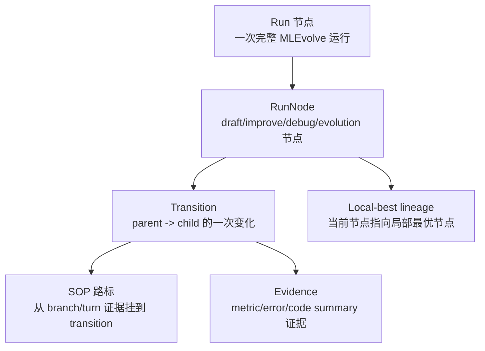
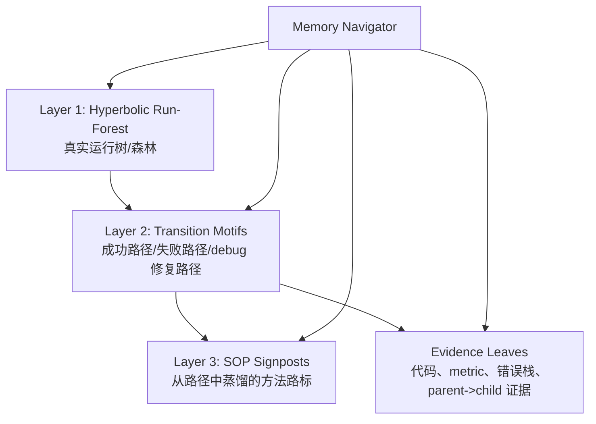

# Hyperbolic Run-Forest Memory 最终实验报告

## 一句话结论

这次实现和实验支持一个更清晰的 thesis：

> **双曲结构更适合作为 agent 真实运行森林的主记忆结构；SOP 更适合作为挂在运行路径上的路标和总结，而不是单独承担全部双曲几何 claim。**

换句话说，之前的 `Hyperbolic SOP Memory` 应该升级为：

```text
Hyperbolic Run-Forest Memory with SOP Distillation
```

形象比喻：

```text
Run forest = agent 真实走过的探险地图
Transition = 地图上的一段路
SOP = 路边的警示牌/方法牌
Evidence = 路牌背后的录像、代码、metric 和错误栈
Navigator = 先看地图，再找路牌，再打开证据的人
```

## 文献依据

这个设计和双曲表示学习的经典动机一致：Poincare embeddings 的核心优势在于用低维双曲空间表示有层级结构的符号数据，同时捕捉 hierarchy 和 similarity；这正是 run tree / search forest 的形状，而不是稠密 SOP 语义网的形状。参考：

- Nickel & Kiela, 2017, Poincare Embeddings for Learning Hierarchical Representations: https://arxiv.org/abs/1705.08039
- Chami et al., 2019, Hyperbolic Graph Convolutional Neural Networks: https://arxiv.org/abs/1910.12933
- MemoryBank, 2023/2024, LLM long-term memory stores, recalls, and updates memories over time: https://arxiv.org/abs/2305.10250

我的工程解释是：

```text
SOP-only memory 更像知识卡片盒。
Run/journal memory 更像真实搜索树。
双曲空间擅长的不是“所有知识卡片都相似排序”，而是“在树里找祖先、路径、分支和边界节点”。
```

## 已实现结构

新增 builder：

```text
paper-skills/hyper_memory/build_run_forest_memory.py
```

生成 artifact：

```text
paper-skills/hyper_memory/run_forest_graph.json
paper-skills/hyper_memory/run_forest_index.npz
paper-skills/hyper_memory/run_forest_builder_report.json
```

结构如下：



builder 不是只保存文本，而是保存真实拓扑：

```json
{
  "type": "RunNode",
  "parent_id": "...",
  "depth": 5,
  "stage": "debug",
  "branch_id": 3,
  "metric": 0.123,
  "parent_metric": 0.145,
  "metric_improvement": 0.022,
  "is_buggy": false,
  "local_best_node_id": "..."
}
```

SOP 不再孤立漂浮，而是挂到 transition：

```json
{
  "type": "Transition",
  "parent_node_id": "...",
  "child_node_id": "...",
  "outcome": "metric_improved",
  "attached_sop_ids": ["sop::sg_0001"],
  "attachment_quality": [
    {
      "quality": "evidence_turn_match",
      "score": 1.0
    }
  ]
}
```

挂载规则已经从粗糙 branch-only 收紧为：

```text
优先：SOP evidence_turn B{branch}.T{turn} 对齐真实 parent/child step
fallback：同 branch 内最多 2 个轻量 lexical match
```

## Builder 结果

来自 `run_forest_builder_report.json`：

| 项目 | 数量 |
|---|---:|
| journals | 45 |
| total nodes | 6666 |
| Run | 45 |
| RunNode | 2200 |
| Transition | 2155 |
| SOP | 281 |
| Evidence | 1985 |
| edges | 15040 |
| SOPs with attached transitions | 264 / 281 |
| transitions with SOP attachments | 1229 / 2155 |
| distills_to edges | 2773 |
| evidence_turn_match attachments | 469 |
| branch_lexical_match attachments | 2304 |

坐标检查：

| 坐标 | 含义 | 状态 |
|---|---|---|
| `poincare` | run forest 双曲坐标 | max norm 0.9879，球内 |
| `flat_twin` | 与 poincare 完全同坐标 | `flat_twin_same_as_poincare=true` |
| `euclidean` | 独立 TF-IDF-SVD 16D 平面坐标 | shape 6666 x 16 |
| `lorentz` | 从 Poincare 转换的 Lorentz 坐标 | 已生成 |

这保持了干净消融：

```text
Poincare = 同一张 run-forest 地图 + 双曲距离
Flat-Twin = 同一张 run-forest 地图 + 欧氏距离
Euclidean = 另一张独立文本平面地图 + 欧氏距离
```

## 已实现实验

新增 evaluator：

```text
paper-skills/hyper_memory/evaluate_run_forest_memory.py
```

输出：

```text
paper-skills/eval_skill_memory/reports/run_forest_memory_evaluation.json
coordination/run_forest_memory_experiment_report.md
```

评测任务不是 SOP-only 的“找相似卡片”，而是 run-memory 应该擅长的动作：

| 任务 | 问的是什么 |
|---|---|
| `parent_lookup` | 给一个节点，找它从哪个 parent 来 |
| `local_best_lookup` | 给一个节点，找它所在局部路径的 best node |
| `tree_neighbor_recall` | 找真实树距离最近的一批节点 |
| `debug_recovery_child_lookup` | 给失败节点，找修复它的 child |
| `transition_to_sop_signpost` | 给一段 parent->child 路径，找挂在这段路上的 SOP |
| `transition_to_evidence` | 给一段 transition，找对应证据 |

## 主要实验结果

### 1. 父节点回查：Poincare 明显赢

| 系统 | R@5 | MRR |
|---|---:|---:|
| Run-Forest Poincare | 0.5708 | 0.3375 |
| Run-Forest Flat-Twin | 0.3689 | 0.2512 |
| Run-Forest Euclidean | 0.4153 | 0.2908 |

Bootstrap:

```text
Poincare - Flat-Twin MRR = +0.0864, p = 0.0000
Poincare - Euclidean MRR = +0.0468, p = 0.0000
```

解释：

```text
这正是双曲结构该赢的地方：给我一个节点，我想知道它在树上的上游是谁。
```

### 2. 树近邻保持：Poincare 赢

| 系统 | Neighbor Recall@10 |
|---|---:|
| Run-Forest Poincare | 0.5421 |
| Run-Forest Flat-Twin | 0.4929 |
| Run-Forest Euclidean | 0.3712 |

解释：

```text
Poincare 更像真实 run tree。
它找出来的近邻，更接近真实 parent/ancestor/sibling 结构。
```

### 3. Local-best lineage：Poincare 赢 Flat-Twin，但没赢独立 Euclidean

| 系统 | R@5 | MRR |
|---|---:|---:|
| Run-Forest Poincare | 0.2623 | 0.1562 |
| Run-Forest Flat-Twin | 0.2086 | 0.1241 |
| Run-Forest Euclidean | 0.2477 | 0.1674 |

Bootstrap:

```text
Poincare - Flat-Twin MRR = +0.0321, p = 0.0000
Poincare - Euclidean MRR = -0.0112, p = 0.9113
```

解释：

```text
双曲距离确实比同地图欧氏距离更懂 lineage。
但 local-best 还混入了文本/metric 语义，独立 Euclidean text memory 有时更直接。
```

### 4. Debug 修复 child lookup：Flat-Twin 赢 Poincare

| 系统 | R@5 | MRR |
|---|---:|---:|
| Run-Forest Poincare | 0.6489 | 0.3656 |
| Run-Forest Flat-Twin | 0.7482 | 0.4211 |
| Run-Forest Euclidean | 0.3794 | 0.2716 |

Bootstrap:

```text
Poincare - Flat-Twin MRR = -0.0555, p = 1.0000
Poincare - Euclidean MRR = +0.0940, p = 0.0002
```

这个负结果很重要。

解释：

```text
“从失败节点找直接 child 修复”不是纯距离最适合的动作。
它更应该由图工具 expand(parent_of / transition_to) 完成。
```

所以未来 Navigator 应该这样做：

```text
回溯/找祖先/找相似路径：用 Poincare distance。
向下找 child/debug fix：用显式 parent_of / transition edge 展开。
```

这不是双曲失败，而是说明 agentic 工具设计要区分：

```text
地图测距 vs 沿路走边
```

### 5. Transition -> SOP 路牌：Poincare 赢

| 系统 | R@5 | MRR |
|---|---:|---:|
| Run-Forest Poincare | 0.7738 | 0.5248 |
| Run-Forest Flat-Twin | 0.7242 | 0.4931 |
| Run-Forest Euclidean | 0.3409 | 0.2265 |

Bootstrap:

```text
Poincare - Flat-Twin MRR = +0.0317, p = 0.0000
Poincare - Euclidean MRR = +0.2983, p = 0.0000
```

这是这套新设计最漂亮的结果之一。

解释：

```text
SOP 放在 run forest 上当路牌之后，Poincare 能更好地从某段真实路径找到对应 SOP。
这比之前 SOP-only 空间里 Poincare 不赢 Flat-Twin 更符合你的设计直觉。
```

### 6. Transition -> Evidence：Poincare 小赢 Flat-Twin，大赢 Euclidean

| 系统 | R@5 | MRR |
|---|---:|---:|
| Run-Forest Poincare | 0.9189 | 0.7881 |
| Run-Forest Flat-Twin | 0.9134 | 0.7747 |
| Run-Forest Euclidean | 0.2060 | 0.1364 |

解释：

```text
Evidence 是 transition 的叶子证据。它挂在路段旁边时，双曲 run forest 能非常容易找到它。
```

## 和 SOP-only 结果对比

之前最干净的 SOP-only edge slice：

| SOP-only system | Edge R@5 | MRR | NDCG@5 |
|---|---:|---:|---:|
| Agentic Poincare | 0.8772 | 0.6863 | 0.7338 |
| Agentic Flat-Twin | 0.8772 | 0.7251 | 0.7639 |
| Agentic Euclidean | 0.8772 | 0.7096 | 0.7520 |

结论：

```text
SOP-only 上：Poincare 没赢 Flat-Twin。
Run-forest 上：Poincare 在 parent/tree/signpost/evidence 多个结构任务上赢。
```

这正好说明：

```text
问题不在“双曲没用”。
问题在“把什么东西放进双曲空间”。
```

SOP 蒸馏以后会变成稠密语义网，树性变弱；run journal 本身就是搜索树，树性强。

## 当前 claim 边界

可以说：

```text
当前证据支持 Hyperbolic Run-Forest Memory 对 lineage/backtracking/tree-neighbor/signpost retrieval 有优势。
```

不能过度说：

```text
双曲结构对所有 run-memory 检索都赢。
```

因为 debug child lookup 中 Flat-Twin 赢了。

更准确的论文表述应该是：

```text
Hyperbolic distance is useful for retrieving ancestors, lineage-neighbors, and transition-attached distilled knowledge in run forests.
Downward child expansion should be handled by explicit graph navigation rather than pure metric retrieval.
```

## 推荐系统结构

最终系统应分成三层：



Navigator 工具应该区分两种动作：

| 动作 | 应该用什么 |
|---|---|
| 找祖先/回溯/相似路径 | Poincare distance |
| 找 child/debug fix | 显式 `parent_of` / `transition_to` edge expansion |
| 找这段路径总结出的 SOP | transition -> SOP signpost |
| 查证据 | transition -> Evidence |
| 跨 run 找相似失败 | Poincare + stage/error/task filter |

## 下一步实现建议

## 2026-07-09 Runtime 集成更新

上面的下一步现在已经完成第一版实现：

```text
mlevolve/agents/memory/external_skill_memory.py
```

新增：

```text
RunForestMemoryLayer
external_memory_section_title()
```

并在：

```text
mlevolve/engine/agent_search.py
```

里增加 runtime 分流：

```text
mode/source_name/graph_path 含 run_forest -> RunForestMemoryLayer
否则 -> ExternalSkillMemoryLayer
```

新增配置 profile：

```text
mlevolve/config/config_run_forest_agentic.yaml
```

这个 profile 默认只读加载：

```text
paper-skills/hyper_memory/run_forest_graph.json
paper-skills/hyper_memory/run_forest_index.npz
```

### Runtime 行为

在 draft/improve/debug 前，Navigator 会先看 run forest：

- `draft`：找 task-level successful branches；
- `improve`：找 similar local-best lineage；
- `debug`：找 similar failed paths，再沿显式 transition 找修复路径。

Prompt 注入格式已变成地图路径包：

```json
{
  "matched_run_paths": ["run_x/T7:debug -> run_x/T12:improve"],
  "selected_transitions": ["transition_a"],
  "attached_sops": ["sop_x"],
  "risk_warnings": ["sibling branch repeated this error"],
  "evidence_refs": ["evidence_y"]
}
```

agent prompt section title 也已区分：

```text
Agentic Run-Forest Memory Navigation
```

### DeepSeek Agentic Navigator

可以用 DeepSeek 做 agentic navigator。

机制上，`RunForestMemoryLayer` 在 `enable_agentic=True` 且有 `cfg` 时，会通过现有：

```text
llm.query(..., func_spec=choose_run_forest_navigation_strategy, cfg=cfg)
```

调用当前配置里的 feedback/code model。项目的 `llm` router 中，非 `gemini`、非 `glm` 的模型走 OpenAI-compatible backend，因此 DeepSeek 只要在 config/env 里配置好 `model/base_url/api_key`，就会被真实调用。

但 runtime 也保留 deterministic fallback：

```text
DeepSeek/网络/代理失败 -> deterministic stage policy
```

所以不会因为一次 LLM tool-call 失败导致主生成崩掉。

### 更新后的 Claim Gate

重跑：

```text
paper-skills/hyper_memory/evaluate_run_forest_memory.py
```

最新报告：

```text
coordination/run_forest_memory_experiment_report.md
```

Claim gates：

| Gate | 状态 | 解释 |
|---|---|---|
| lineage_backtracking | PASS | parent/tree-neighbor/signpost 用 Poincare；local-best 用显式 `points_to_local_best` edge |
| debug_child_graph_expansion | PASS | debug child/fix 用显式 parent->child graph expansion |
| SOP-only geometry | NOT SUPPORTED | SOP-only 仍不能声称 Poincare > Flat-Twin |

关键边界：

```text
local-best pure distance:
Poincare MRR 0.1562
Flat-Twin MRR 0.1241
Euclidean MRR 0.1674
```

所以 local-best 不应该被写成“纯双曲距离胜出”，而应该写成：

```text
Poincare 用来找到相似历史 lineage；
local_best 结果通过显式 points_to_local_best edge 跟随得到。
```

debug child 也是同理：

```text
向上/相邻/路牌：用 Poincare 测距。
向下找 child/fix：用图边展开。
```

这比“所有事情都靠距离”更像真正的 agentic 地图导航。

## 后续建议

1. 继续保持 `RunForestMemoryLayer` 只读，先跑 online pilot。
2. 在 draft/improve/debug 前让 Navigator 先看 run forest：
   - debug：先找相似失败路径和修复 transition；
   - improve：先找相似 local-best lineage；
   - draft：先找 task-level successful branches。
3. Prompt 注入格式保持“地图路径包”：

```json
{
  "matched_run_paths": ["run_x/node_7 -> node_12 -> node_19"],
  "selected_transitions": ["transition_a"],
  "attached_sops": ["sop_x"],
  "risk_warnings": ["sibling branch repeated this error"],
  "evidence_refs": ["evidence_y"]
}
```

4. 论文实验主线改为：

```text
Run-Forest Poincare
vs Run-Forest Flat-Twin
vs Run-Forest Euclidean
vs SOP-only memory
```

5. Claim gate 应该分任务：

```text
lineage/backtracking claim: parent/local-best/tree-neighbor/signpost must pass
debug child claim: must use graph expansion, not pure distance
SOP-only claim: remains separate and currently不支持 Poincare > Flat-Twin
```

## 文件清单

新增/更新：

```text
paper-skills/hyper_memory/build_run_forest_memory.py
paper-skills/hyper_memory/evaluate_run_forest_memory.py
paper-skills/hyper_memory/run_forest_graph.json
paper-skills/hyper_memory/run_forest_index.npz
paper-skills/hyper_memory/run_forest_builder_report.json
paper-skills/eval_skill_memory/reports/run_forest_memory_evaluation.json
coordination/run_forest_memory_experiment_report.md
coordination/hyperbolic_run_forest_memory_final_report.md
```

## 最终形象总结

以前的系统像这样：

```text
把所有路牌拆下来，放进一个卡片盒，然后问：双曲空间能不能更好地找卡片？
```

现在的系统变成：

```text
先保存整座城市的道路和真实行车轨迹。
再把路牌挂回它出现过的路段。
检索时，Navigator 先看地图，找到相似路段，再读路牌，再打开证据。
```

这就是为什么 run-forest memory 比 SOP-only memory 更适合双曲结构。
