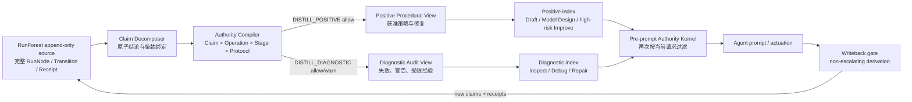

# SOP 蒸馏协议控制全面评估

> 日期：2026-07-18  
> 代码与图快照：当前 `/Users/haoming/Downloads/nautilus` 工作树  
> 目标：比较 Clean-only Distillation（只蒸馏获准内容）、Full Distillation + Protocol Tags（全部蒸馏并打协议标签）及 Claim-wise Dual View（结论级双视图）。  
> 结论边界：本文包含真实图统计、冻结回顾性 benchmark、确定性混合价值测试和 DeepSeek 在线机制探针；尚未完成完整 MLE 代码生成、执行采纳与多代污染实验。

## 1. 一句话结论

**给 SOP 的蒸馏过程和蒸馏结果加入协议控制是必要且有价值的，但不能只给整条 SOP 打一个标签。当前最合适的设计是：RunForest 全量保存；按 Claim/Clause（结论/条款）授权蒸馏；生成 Positive Procedural View（正向程序视图）与 Diagnostic Audit View（诊断审计视图）；在内容进入检索排序和 prompt 之前按 `Claim × Operation × Stage × Protocol` 激活。**

如果只比较用户提出的两个原始方案：

1. 整个 RunNode 只要有问题就完全不蒸馏：过于保守，不推荐。
2. 全部内容蒸馏到同一 SOP，只给整条 SOP 一个标签：不能正确表达混合价值，不推荐。
3. 只蒸馏 RunNode 中获准的 Claim，并让每个派生 Claim 继承协议范围：是安全且容易落地的生产基线。
4. 全量来源保留、Claim 级标签、双视图预激活：是推荐的完整研究架构。

因此，最准确的方案不是“二选一”，而是：

> **Store all sources, distill by claim, activate by authority（来源全存、按结论蒸馏、按权限激活）。**

## 2. 为什么整条 SOP 标签在原则上不够

考虑一个 SOP 同时包含两个 Claim：

- `C_debug`：正确修复 OOF index misalignment（OOF 索引错位），允许 Debug 和 Repair Seed；
- `C_score`：因为使用 test labels 得到 0.92，禁止 Rank、Select、Promote 和 Code Seed。

如果只给整个 SOP 一个权限标签：

- 取两个 Claim 权限的并集：SOP 可以 Rank，于是无效的 0.92 被放行；
- 取两个 Claim 权限的交集：SOP 不能用于 Repair Seed，于是合法的 OOF 修复也丢失；
- 让 LLM 自己阅读标签后判断：能够工作，但安全性依赖提示遵循，且内容已经进入上下文。

所以 Mixed-value SOP（混合价值 SOP）无法用单一标签同时实现零污染和零误删。权限单元至少必须下降到 Claim 或 Clause。

## 3. 当前真实图说明这不是少数边界案例

评估脚本：

```text
paper-skills/eval_composite_memory/evaluate_sop_protocol_policies.py
```

结果文件：

```text
paper-skills/eval_composite_memory/reports/sop_protocol_policy_evaluation_v1.json
```

### 3.1 当前规模

| 对象 | 数量 |
|---|---:|
| RunNode | 1,508 |
| SOP | 281 |
| `distills_to` 边 | 2,773 |

### 3.2 SOP 来源构成

暂时以当前生产代码的 RunNode clean gate（干净门）作为 node-level proxy（节点级代理）：

| SOP 来源类型 | 数量 | 占 281 条 SOP |
|---|---:|---:|
| 只有正向来源 | 1 | 0.36% |
| 正向与非正向来源混合 | 135 | 48.04% |
| 只有非正向来源 | 128 | 45.55% |
| 没有蒸馏来源边 | 17 | 6.05% |

在 2,773 条蒸馏边中：

- 345 条通过当前 RunNode 正向代理；
- 2,428 条没有通过；
- 也就是说，Clean-only edge view（只保留正向边）会删除 87.56% 的蒸馏边。

最重要的发现是：**135/281 个 SOP 是混合来源，只有 1 个 SOP 是纯正向来源。** 因此，“SOP 蒸馏后自然变干净”与当前数据明显矛盾。

### 3.3 当前严格 Authority 状态

当前 2,773 条 `distills_to` 边全部为：

```text
authority_outcome = quarantine
reasons = [missing_runtime_actuation, missing_counterfactual_actuation]
```

当前 SOP 字段覆盖：

| 字段 | 有该字段的 SOP |
|---|---:|
| `clause_lineage` | 281 |
| `derived_publication_authority=allow` | 281 |
| `protocol_ref` | 0 |
| `claim_refs` | 0 |
| `receipt_refs` | 0 |
| 按 Operation 的 authority scope | 0 |
| `protocol_agnostic=true` | 0 |

因此当前 `derived_publication_authority=allow` 只能解释为“允许复制或规范化文本且不扩大文本 scope”，不能解释为“允许该 SOP 影响 Rank/Promote/Code Seed”。

## 4. 四类方案的准确比较

### 4.1 A0：Whole-Run Clean-only（整条运行一刀切）

规则：只要 RunNode 中有一个重要 Claim 无效，就不产生任何 SOP 内容。

优点：

- 实现最简单；
- 未授权内容不会进入 SOP 或 prompt；
- 洗白攻击面小。

缺点：

- 混合价值运行中的合法 Debug 知识被一起删除；
- 当前 135 条混合来源 SOP 会受到严重影响；
- 它本质上仍是 Global Validity Bit（全局有效位）。

判断：**不推荐。仅可作为安全下界 baseline。**

### 4.2 A1：Claim-filtered Clean-only（按结论过滤蒸馏）

规则：RunForest 保留全部原始运行；只有获得 `DISTILL_POSITIVE` 权限的 Claim 进入正向 SOP，每个派生 Claim 继续继承 Protocol 和 Operation scope。

优点：

- 未授权内容不进入正向 SOP；
- 当前 Draft/Model Design 主要使用 SOP、Debug 主要使用 RunForest，与现有阶段路由吻合；
- 实现和审计成本低于全量标签方案；
- 本次冻结 benchmark 表明，只保留当前 clean proxy 的 345 条边没有降低现有正向检索指标。

缺点：

- 如果不额外创建 Diagnostic SOP，Debug-only 知识只能回 RunForest 查找；
- “在 v2 下合法”仍不等于 protocol-agnostic，因此即使是 clean Claim 也必须保留 protocol scope；
- Claim decomposition（结论拆分）错误会造成合法知识误删。

判断：**最适合作为下一步生产实现和强 baseline。**

### 4.3 B0：Full Distillation + One SOP Tag（全量蒸馏加整条 SOP 标签）

规则：所有来源内容进入同一个 SOP，SOP 只有一个汇总权限标签。

优点：

- 信息保留完整；
- 数据结构简单。

缺点：

- 对混合 Claim，权限并集不安全、交集误删；
- 合并 SOP 后这个问题更严重；
- DeepSeek 在线探针中，whole-SOP tag 虽然没有明显 Rank 误选，但 Rank 输出格式成功率只有 83.3%，Debug 为 91.7%，并出现一次禁止选项，说明顶层标签和内部 Claim 冲突会造成不稳定或弃权。

判断：**不推荐。整条 SOP 标签只能做显示摘要，不能做真正授权单元。**

### 4.4 B1：Full Distillation + Claim Tags（全量蒸馏加结论级标签）

规则：所有 Claim 都进入 SOP，但每个 Claim 保存独立权限；检索后由 LLM 或后置 gate 忽略无权 Claim。

优点：

- 保留全部审计与诊断信息；
- 能正确表示混合价值；
- DeepSeek 的简单在线探针中，Claim tags 即使进入 prompt，Rank 和 Debug 都达到 24/24 正确，证明“标签随内容进入 prompt 就必然污染”并不成立。

缺点：

- 未授权内容仍参与 embedding、候选排序或 prompt 构造；
- 安全性部分依赖 LLM 遵守标签；
- 需要确保 Summary→SOP→Merged SOP→Template 每一步都不可丢标签、不可扩权；
- 当前简单 DeepSeek 探针没有覆盖 prompt injection、长上下文、标签冲突、多代改写或代码生成采纳。

判断：**是强 baseline，也可能成为够用的工程方案；但不能只靠当前简单测试宣称结构安全。**

### 4.5 C：Claim-wise Dual View（结论级双视图）

规则：

1. RunForest 与 append-only audit store 保存所有来源；
2. `Diagnostic View` 保存允许 Inspect/Debug 的 Claim、失败原因和警告；
3. `Positive Procedural View` 只保存当前 Operation/Stage/Protocol 获准的派生 Claim；
4. 在 ANN ranking（向量排序）和 prompt 构造之前完成权限过滤；
5. 两个视图共享 immutable lineage（不可变来源链），不是两份独立真相。

优点：

- 保留全部审计价值；
- 高风险 prompt 不暴露无权内容；
- 权限不会因摘要、合并或模板化而扩大；
- 最适合证明 IIR–VKR（无效影响率—合法知识保留率）安全—效用 Pareto 优势。

缺点：

- 数据模型、索引和测试最复杂；
- 当前 DeepSeek 简单探针中，它与 B1、A1 都达到 100% Rank，尚未证明行为优势；
- 必须增加 adversarial/multi-generation/code-adoption 测试，才能证明额外复杂度必要。

判断：**推荐的完整架构和研究方案，但 B1 是必须击败的强 baseline。**

## 5. 实验结果

### 5.1 Frozen retrospective benchmark（冻结回顾性检索）

比较三个临时图视图；所有视图节点与坐标相同，只改变蒸馏关系及 Transition 中重复保存的 attachment 字段。

| 图视图 | 蒸馏边 | Granularity Precision@5 | Empty rate | Debug test route accuracy | Debug test selective accuracy |
|---|---:|---:|---:|---:|---:|
| 当前 full metadata-only | 2,773 | 1.00 | 0.00 | 0.80 | 0.76 |
| Clean-only node proxy | 345 | 1.00 | 0.00 | 0.80 | 0.76 |
| 严格执行当前 edge authority | 0 | 0.00 | 1.00 | 0.52 | 0.52 |

解释：

1. 当前正向检索本来就用 RunNode clean gate，因此物理删除 2,428 条非正向边没有改变现有指标。
2. 这支持先落地 A1：把当前隐式 clean-support gate 变成显式 authorized positive edge。
3. 不能现在直接开启严格 Authority enforce；因为所有蒸馏边都缺 actuation receipts，强制执行会让 SOP 检索完全为空。
4. 严格视图最初只删除边时 Debug 指标没有变化。追踪后发现 `_causal_attachment_rows()` 直接读取 Transition 内的 `attached_sop_ids`，绕过了 `distills_to` 边。测试同步过滤该字段后，Debug 才下降。**这证明当前有第二条权限旁路，生产修复必须同时控制边和嵌入式 attachment。**

### 5.2 Deterministic mixed-value test（确定性混合价值测试）

测试包括数据泄漏、评估器篡改、种子选择偏差、协议漂移、改变方法的伪重放和派生记忆洗白，共 6 个混合经验、12 个 Claim、168 个 Claim-use 请求。

| 策略 | Valid Knowledge Retention | Unauthorized Activation | Unauthorized Prompt Exposure | Audit SOP Retention |
|---|---:|---:|---:|---:|
| Whole-run clean-only | 0.0% | 0.0% | 0.0% | 0.0% |
| Claim-filtered clean-only | 61.0% | 0.0% | 0.0% | 50.0% |
| Whole-SOP union tag | 100.0% | 38.5% | 38.5% | 100.0% |
| Whole-SOP intersection tag | 54.5% | 0.0% | 0.0% | 100.0% |
| Full Claim tags, post-prompt gate | 100.0% | 0.0% | 38.5% | 100.0% |
| Claim dual view, pre-prompt gate | 100.0% | 0.0% | 0.0% | 100.0% |

这是 expressivity sanity check（表达能力健全性检查），不是下游性能实验。它证明单一 SOP 标签的结构性取舍，但数字依赖手工定义的权限真值。

### 5.3 DeepSeek online mechanism probe（在线机制探针）

配置：

- 与 MLEvolve 保持一致的 `deepseek-chat`；
- 8 类 Rank 污染案例与 8 类 Debug 记忆案例；
- 6 种记忆策略；
- 3 次重复；
- 共 288 次 API 调用，0 API 错误；
- 输出：`outputs/sop_protocol_prompt_exposure_deepseek_v1.json`。

#### Rank 轨道

| 条件 | Accuracy | Forbidden choice rate | Parse rate |
|---|---:|---:|---:|
| Whole-run clean-only | 50.0% | 50.0% | 100.0% |
| Claim-filtered clean-only | 100.0% | 0.0% | 100.0% |
| Full Claim tags post-prompt | 100.0% | 0.0% | 100.0% |
| Whole-SOP tag post-prompt | 83.3% | 0.0% | 83.3% |
| Dual view pre-prompt | 100.0% | 0.0% | 100.0% |
| Untagged polluted | 25.0% | 75.0% | 100.0% |

#### Debug 轨道

Debug 题使用随机 Patch ID，只有记忆才能知道正确答案。

| 条件 | Accuracy | Accuracy on parsed | Forbidden choice rate | Parse rate |
|---|---:|---:|---:|---:|
| Whole-run clean-only | 58.3% | 58.3% | 41.7% | 100.0% |
| Claim-filtered clean-only | 100.0% | 100.0% | 0.0% | 100.0% |
| Full Claim tags post-prompt | 100.0% | 100.0% | 0.0% | 100.0% |
| Whole-SOP tag post-prompt | 87.5% | 95.5% | 4.2% | 91.7% |
| Dual view pre-prompt | 100.0% | 100.0% | 0.0% | 100.0% |
| Untagged polluted | 95.8% | 100.0% | 0.0% | 95.8% |

在线测试支持以下结论：

1. 没有标签的高分污染确实强烈改变 Rank 决策。
2. 整条运行一刀切会丢失合法 Rank/Debug 信息。
3. 整条 SOP 标签容易制造内部权限冲突和输出不稳定。
4. DeepSeek 在当前短 prompt 中能正确遵守 Claim 级标签。
5. **当前测试没有证明 Dual View 的决策准确率优于理想的 Full Claim Tags。** Dual View 的优势目前是结构保证、审计保留和减少未授权 prompt exposure；是否带来行为收益必须通过更强攻击与多代实验验证。

## 6. 推荐程序架构



### 6.1 SOP 不再拥有一个全局 `valid`

推荐 schema：

```yaml
sop_id: sop::oof_alignment
title: Preserve sample identity across OOF folds

clauses:
  - clause_id: c_debug_fix
    text: Join OOF predictions by immutable sample keys.
    claim_type: DEBUG_REPAIR
    parent_claim_refs:
      - node:run123:debug_repair
    receipt_refs:
      - receipt:runtime:abc
    authority_scope:
      operations: [INSPECT, DEBUG_HYPOTHESIS, REPAIR_SEED]
      stages: [debug, protocol_repair]
      protocol_hashes: [agnostic]
    view: diagnostic_and_procedural

  - clause_id: c_score
    text: The historical run reported 0.92.
    claim_type: SCORE
    parent_claim_refs:
      - node:run123:score
    authority_scope:
      operations: [INSPECT]
      stages: [error_analysis]
      protocol_hashes: [protocol-v2-hash]
    blockers: [test_label_selection]
    view: diagnostic_only
```

### 6.2 两类蒸馏操作

不建议继续让一个 `DISTILL` 同时承担正向程序和负面诊断两种语义。至少增加 `target_view`，更清楚的版本是：

- `DISTILL_POSITIVE`：派生内容可进入正向 SOP 和高风险决策；需要完整证据与 actuation receipt；
- `DISTILL_DIAGNOSTIC`：允许把失败或污染经验压缩成警告、修复假设或审计摘要；不能支持 Rank/Promote/Code Seed。

蒸馏只是文本变换，不产生新权限：

```text
derived_scope(clause)
  = requested_scope
    ∩ intersection(parent_claim_scopes)
    ∩ active_protocol_compatibility
```

如果交集为空，条款可以留在 append-only source，但不能进入对应 SOP view。

### 6.3 `protocol-agnostic` 必须默认 false

只有满足以下条件的 Claim 才能标为 protocol-agnostic（协议无关）：

1. 不依赖 score、metric direction、split、holdout、seed aggregation 或 evaluator；
2. dependency slice（依赖切片）中没有协议绑定的结果 Claim；
3. 表达的是 API invariant、shape contract、路径规则、资源约束或纯方法结构；
4. 通过至少一个 deterministic validator（确定性验证器）；
5. 无法证明时保持 protocol-scoped，而不是由 LLM 猜测为 agnostic。

### 6.4 必须在 prompt 前执行

执行顺序应为：

```text
Stage/task coarse routing
→ Claim authority filtering
→ ANN/lexical ranking inside authorized partition
→ prompt construction
→ runtime actuation receipt
```

如果向量数据库不支持 metadata prefilter，应建立 Positive/Diagnostic 两个物化索引或使用 authority bitset（权限位图）过滤候选。不能把全部内容先放入 prompt，再仅靠一句“不要使用”。

## 7. 当前代码必须修的 P0 项

### P0-1：RunForest builder 复制真正 Authority 字段

当前 graph artifact 中 1,508 个 RunNode 虽有 leakage audit，但没有复制 journal 中的：

- `claim_refs`
- `receipt_refs`
- `authority_decision_refs`
- `protocol_ref`
- `method_fingerprint`

因此 SOP 目前没有真正可继承的 Claim authority。

### P0-2：不要把 Transition/RunNode ID 伪装成 Claim ref

当前 builder 使用：

```text
parent_claim_refs = [transition_id, child_node_id]
```

它是来源 artifact link，不是真实 Claim ID。建议拆成：

- `parent_artifact_refs`
- `parent_claim_refs`
- `parent_decision_refs`

缺少真实 Claim 时必须 quarantine。

### P0-3：统一两条 SOP attachment 通道

目前 SOP 关系同时存放在：

- graph edge：`distills_to`
- Transition field：`attached_sop_ids` / `attachment_quality`

权限过滤只改一条通道会被另一条绕过。建议把 edge 作为唯一事实源；Transition 的列表只能是带 authority hash 的派生缓存，并在加载时验证一致性。

### P0-4：区分 attachment 与 authorized distillation

建议关系：

- `evidence_attached_to`：保留所有语义或来源关联，可用于审计/Debug；
- `authorized_distills_to`：只有 Claim scope、Protocol、Receipt 与 non-escalation 全部通过，才进入正向索引。

### P0-5：在闭环完成前不要直接开启 enforce

严格视图当前有 0 条授权蒸馏边，直接 enforce 会让 SOP 检索为空。顺序应为：

1. 补全 Claim 与 Receipt；
2. 让 `authorized_distills_to` 获得非零覆盖；
3. shadow parity；
4. 小流量 enforce；
5. 才能进入完整在线实验。

## 8. 推荐实施顺序

### Phase 1：先落地 A1，建立可用安全基线

1. Builder 复制真实 Authority refs；
2. 按 Claim/Clause 拆分 SOP；
3. 只生成 Positive SOP index；
4. 所有 SOP Claim 保留 protocol scope，即使当前审计 clean；
5. 用现有 frozen benchmark 保证 Granularity 与 Debug 指标不回退。

### Phase 2：增加 Diagnostic View，形成 C

1. 增加 `DISTILL_DIAGNOSTIC`；
2. 将污染分数、失败原因和修复假设放入诊断视图；
3. Inspect/Debug 可以检索，Rank/Promote/Code Seed 不可见；
4. 新增 pre-prompt authority bitset；
5. 增加双视图一致性和 non-escalation 测试。

### Phase 3：完成论文级在线实验

1. 真实 MLE 代码生成，而不是选择题；
2. 记录检索、prompt exposure、Claim adoption、AST diff 和 runtime events；
3. 比较 Global Bit、A1、B1、C、Oracle；
4. 做 3–5 代 Summary→SOP→Merged SOP→Template 污染传播；
5. 做 Protocol v2→v3 和 clean replay successor；
6. 至少两个 task family、多个 seeds、paired budget。

## 9. 论文 novelty 的真实判断

### 9.1 不能单独作为 novelty 的部分

- “SOP 加 protocol tag”；
- “只蒸馏 clean run”；
- “来源标签随摘要传播”；
- “权限不应在派生时扩大”；
- “在使用前检查 evidence”。

这些分别接近访问控制、信息流、provenance、procedural memory governance 和 release gate。此前 IdeaSpark 审计也认为，仅把这些组件形式化组合起来容易被 reviewer 判断为 engineering assembly（工程组装）。

直接相关的最新边界包括：

- [Procedural Memory Distillation](https://arxiv.org/abs/2607.01480) 已经把 raw trajectories、reflected strategies/lessons 和 recurring patterns 组成三级程序记忆并继续蒸馏进模型；所以“从运行轨迹分层蒸馏 SOP”本身不新。
- [Janus / The Past Is Prologue](https://arxiv.org/abs/2606.31121) 已经用外部 controller 决定是否接受 sequential memory update；所以“给记忆更新加 accept/reject gate”本身不新。
- [Are We Ready For An Agent-Native Memory System?](https://arxiv.org/abs/2606.24775) 已经把表示、抽取、检索路由和维护分开评测，并直接测 update correctness 与 long-horizon stability；所以本文必须做模块级和长期污染实验，不能只报最终任务分数。
- [Agent-Safety Evaluations as Load-Bearing Evidence](https://arxiv.org/abs/2607.12469) 已经提出 per-decision Evidence Sufficiency Cards、release check、claim-evidence overclaim gap 和 replayability precondition probe；所以“证据卡加发布门”与“重放前置条件”不能作为本文单独 novelty。

这些工作没有从其摘要直接给出本项目所需的 `mixed Claim × Operation × Stage × Protocol` SOP 激活闭环，但它们使“组件组合”这一主张非常危险。论文必须靠新的可重复现象和 safety–utility 结果，而不是靠改名。

### 9.2 仍有潜力的论文主张

更强的论文点应是一个实证发现与系统结果：

> 在递归 MLE Agent 中，SOP 普遍是 mixed-value derived memory（混合价值派生记忆）；whole-item clean filtering 与 whole-SOP authority aggregation 分别造成知识误删和权限泄漏。Claim-wise dual-view actuation 在多代蒸馏中取得更低 Invalid Influence Rate，同时保持更高 Valid Knowledge Retention，并通过 runtime receipts 证明这些记忆实际改变了代码和后续记忆。

当前真实图的 `135/281 mixed-source SOP` 是有价值的现象证据，但还不是论文结论，因为当前只有 node-level proxy，没有人工 Claim 真值。

### 9.3 当前必须诚实承认的反证

DeepSeek 简单测试中：

- Full Claim Tags post-prompt：Rank 100%，Debug 100%；
- Dual View pre-prompt：Rank 100%，Debug 100%。

所以当前不能声称“pre-prompt dual view 已经优于 Claim tags”。如果在长上下文、代码生成、多代改写和攻击测试中 B1 仍与 C 相同，就应采用更简单的 B1/A1，并放弃把 Dual View 作为主 novelty。

## 10. Kill gates（主动否决条件）

以下任一结果出现，都应收窄或放弃完整 C 方案的论文主张：

1. B1 在 adversarial、long-context、code-adoption 和 multi-generation 测试中与 C 的 IIR/VKR 无显著差别；
2. Claim decomposition 无法可靠绑定原始代码、metric 和 Receipt；
3. A1 已达到与 C 相同的安全—效用曲线，而 Diagnostic SOP 没有额外 Debug 收益；
4. 多代污染只在故意删除标签的非现实攻击下出现；
5. Runtime Actuation Receipts 无法证明检索经验真实改变代码；
6. `protocol-agnostic` 分类跨任务泛化失败，需要大量 task-specific if/else。

## 11. 最终决策

### 对当前系统

立即采用：

> **A1：Claim-filtered positive SOP + full RunForest source retention，并让所有 SOP Claim 继承协议范围。**

这是当前最小、最安全、最不破坏已有 Dynamic Hybrid 的改动。

### 对完整架构与论文

目标采用：

> **C：Claim-wise Dual View。正向 SOP 只承载获准程序知识，诊断视图保存受限知识与警告；两者共享不可变来源链，并在 prompt 前按当前决策请求激活。**

但 C 必须将 B1 作为强 baseline；当前 DeepSeek 结果只证明它结构上更严格，没有证明决策准确率更高。

## 12. 可复现命令与验证状态

本地策略评估：

```bash
.venv/bin/python \
  paper-skills/eval_composite_memory/evaluate_sop_protocol_policies.py
```

DeepSeek 在线测试：

```bash
set -a
. mlevolve/.env
set +a
.venv/bin/python \
  paper-skills/eval_composite_memory/run_sop_protocol_prompt_exposure_deepseek.py \
  --output outputs/sop_protocol_prompt_exposure_deepseek_v1.json \
  --repetitions 3 \
  --workers 6 \
  --temperature 0.7
```

验证：

- 两个新增评估脚本通过 `py_compile`；
- 本地策略评估完整运行成功；
- DeepSeek 288 次调用完成，0 API 错误；
- GPU dev pod 已清理；
- 相关原有测试为 23 passed、1 failed。失败是冻结 held-out lock 中 `leakage_audit.py` 的旧 SHA 与当前工作树不一致，不由本评估脚本导致；未擅自更新冻结锁。
