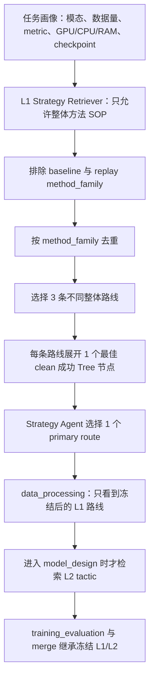

# RunForest 三角色与分层记忆检索研究笔记

> 更新时间：2026-07-11
>
> 当前版本：本文所在的 `Layer Novel Draft strategy retrieval` 提交
>
> 升级前 checkpoint：`5cbeb562`
>
> 当前状态：实现完成，本地测试与 no-GPU preflight 通过；尚无新的同期在线训练结论

## 我现在到底在做什么

一句话目标：让 Agent 在 Novel Draft 阶段先选择一条有真实成功运行支撑的整体模型路线，再在写 `model_design` 时读取与该路线兼容的实现细节，而不是一开始就被路径、API、pooling 等零碎 SOP 带偏。

形象地说：

- **RunForest 是完整探险地图**：保存 run、节点、父子变化、成功、失败、metric、代码和 local-best 路径。
- **Transition 是脚印**：说明从父节点到子节点具体改了什么，以及结果变好、变差还是崩溃。
- **SOP 是路牌**：概括一类方法或修复，但路牌本身不是成功证据。
- **Evidence 是录像和收据**：代码 hash、metric、错误、泄漏审计和执行状态。
- **Taxonomy 是路牌分区**：明确哪些是整体路线、哪些是模型细节、哪些只是故障修复。

## 为什么要做这次升级

旧 Stage Hybrid 在第三个 Draft 中实际选过：

- `sg_0227`：Transformer mean pooling。
- `sg_0069`：正确数据路径。
- `sg_0115`：ModernBERT dropout API 配置。

这些建议本身不一定错误，但它们回答的是“某个部件怎么写”或“报错怎么修”，没有回答 Draft 最重要的问题：**整体采用什么模型训练方案**。

问题根因不是简单的 SOP 权重 0.70 太高，而是旧检索没有方法层级门禁。一个路径修复 SOP 只要词面匹配，就可能和完整 DeBERTa、XGBoost、Transformer ensemble 路线争夺同一个前三名位置。

## 三角色现在如何分工

| 顺序 | 角色 | 记忆行为 |
|---|---|---|
| 1 | `coldstart_baseline` | 只使用第三方原版 cold-start 第一个适用模型；不接收 RunForest L1/L2。 |
| 2 | `memory_reproduction` | 精确读取 replay 源代码；有泄漏风险时只作为 blocked repair seed；不接收普通策略检索。 |
| 3 | `novel_exploration` | 执行 L1 方法路线检索、clean Tree 展开、策略选择和 model-design-time L2 检索。 |

启用角色策略时：

- `initial_drafts = 3`。
- `num_drafts = 3`。
- 根节点只能生成以上三个 Draft。
- 多余 GPU worker 等待或扩展已经完成的节点，不能再创建第四个 Novel 根节点。
- baseline/replay 子节点继续继承各自隔离规则。

## Novel Draft 的真实检索顺序

重要边界：这套 L1/L2 流程只属于第三个 `novel_exploration` 角色。它不是全局 Prompt，也不会进入 baseline 或 replay。

## SOP Taxonomy

当前 `hyper_graph.json` 中 281 条 SOP 已全部分类：

| 层级 | 数量 | 用途 |
|---|---:|---|
| `L1_strategy` | 28 | 完整模型路线、主要模型家族、整体 ensemble 或端到端 pipeline。 |
| `L2_tactic` | 101 | pooling、loss、optimizer、feature、CV、训练协议等实现细节。 |
| `L3_repair` | 152 | API、路径、shape、OOM、代码顺序、泄漏修复等。 |

每条 SOP 都有：

- `abstraction_level`
- `sop_kind`
- `method_family`
- `task_families`
- `decision_stages`
- `compute_profile`

分类由确定性规则和显式 override 生成，运行时不让 LLM 临时猜。28 条 L1 全部列在 `reviewed_l1_ids` 人工复核清单中；规则变化导致 L1 集合与清单不一致时会直接失败。taxonomy 保存源图 SHA；缺失 SOP、非法字段、覆盖率不足或源图 hash 变化都会在 preflight fail closed。

已人工钉死的关键例子：

- `sg_0089`、`sg_0221`、`sg_0164` 是 L1。
- `sg_0227` 是 L2，只有路线选定后才能出现。
- `sg_0069`、`sg_0115` 是 L3，Draft 方法选择时禁止出现。
- `sg_0108`、`sg_0202` 属于 replay 的 `deberta_xgb_lr_ensemble`，会被 Novel L1 排除。

## L1 如何选三条路线

硬门禁：

1. 必须是 `L1_strategy + model_strategy + draft`。
2. `method_family` 不能等于 cold-start baseline 或 replay family。
3. 必须存在同任务的 clean、执行成功、metric 有效、rank-eligible Tree 节点。
4. Transition/RunNode 不能是 buggy、quarantined、protocol-biased 或 metric 缺失。
5. 三条路线必须属于三个不同 method family。

固定评分：

| 项目 | 权重 |
|---|---:|
| 任务匹配 | 0.30 |
| 语义匹配 | 0.20 |
| clean 成功证据 | 0.25 |
| 任务内 improvement percentile rank | 0.15 |
| 算力匹配 | 0.10 |

原始 metric 只作为证据展示，不进入跨任务评分。0.15 的提升项使用同一任务候选之间的 percentile rank，不直接比较 log loss、AUC、RMSE 的数值尺度。少于三个合法 family 时返回 `insufficient_strategy_coverage`，不能用细节 SOP 补齐名额。

## L2 如何工作

L2 只在 `model_design` 即将开始时调用一次：

- `data_processing` 只收到选定的 L1 路线和任务画像。
- `model_design` 收到最多四条 family-compatible 的 architecture、feature、loss、optimizer 或训练 tactic。
- 模型专属 L2 会标记亲缘关系，例如 `deberta_family`、`roberta_family`；不能把 DistilRoBERTa 细节塞进 DeBERTa 路线。
- 真正通用的 focal loss、mean pooling 等可以标为 `general`。
- `training_evaluation` 和 merge 只能继承这份冻结决策，不进行第三次检索。
- Improve 继续 Tree-heavy `0.40/0.60`，但围绕 inherited family。
- Debug 继续 `0.25/0.75`，只看 L3 故障与修复。

## 当前 smoke 中实际拿到的方案

Spooky no-GPU smoke 中，排除 `modernbert_finetune` baseline 和 `deberta_xgb_lr_ensemble` replay 后，L1 返回：

1. `sg_0221`：`deberta_multisample_focal_cv`，clean evidence metric `0.405297`。
2. `sg_0213`：`deberta_finetune`，clean evidence metric `0.296175`。
3. `sg_0118`：`frozen_transformer_tree`，clean evidence metric `0.454066`。

确定性 smoke 选择第一条 `deberta_multisample_focal_cv` 路线后，L2 返回 DeBERTa-compatible 或通用细节：`sg_0225`、`sg_0087`、`sg_0227` 和 `sg_0114`。这说明 mean pooling 仍然可用，但它已从“整体路线候选”降回正确的“路线内实现细节”。

## 审计、执行和 adoption

每个 Novel 节点保存：任务画像、三条候选路线、排除 family、最终策略、L2 refs、Tree evidence 和 navigation trace。

adoption 状态区分：

- `strategy_candidate_inspection`
- `strategy_prompt_injection`
- `tree_evidence_expansion`
- `tactic_prompt_injection`
- `fully_adopted`
- `partially_adopted`
- `rejected_after_inspection`
- `not_adopted`

代码生成后会检查实际组件是否符合 selected method family。缺少关键模型/ensemble 成员时可以继续执行以保留诊断证据，但不能进入 certified ranking，也不能标成完整采纳。

泄漏与 repair 门禁：

- pre-execution audit 只有 `status=clean` 才允许 GPU 执行。
- `protocol_biased` 即使不是原来的 hard block，也会在执行前被拦截。
- 普通局部泄漏仍走 mandatory repair；协议级偏差改走独立的 staged protocol repair transaction。
- staged repair 必须同时通过当前阶段、leakage 和 preservation audit。
- blocked replay seed 永不执行、永不排名。
- repair FIFO 去重；协议修复按阶段分别计数，原模型 preservation contract 不能逐轮缩水。

## 协议偏差如何独立修复

当代码方向有保留价值，但存在 transductive fitting、early-stopping reuse、OOF 缺失、ensemble 选择偏差或 final holdout 复用时，不再交给普通 Debug Agent 连续自由重写。系统创建一个 `staged_protocol_repair` transaction：

阶段会按代码能力裁剪：单模型且没有 early stopping 时只需 `data_scope → final_holdout`；存在 early stopping 才增加 `validation_provenance`；存在 ensemble、stacking 或监督式二级特征才增加 `cross_fit`；存在权重或超参数搜索才增加 `selection_freeze`。这不是 Spooky/DeBERTa 特例。

任务画像只决定协议，不决定模型：

| 画像 | 强制协议 |
|---|---|
| 分类 | 默认 stratified outer split；除非是 grouped/temporal |
| 回归 | random/grouped/time-ordered outer split，按任务语义选择 |
| 分组任务 | GroupKFold/StratifiedGroupKFold，group 不得跨 fold |
| 时间序列 | chronological/TimeSeriesSplit，未来数据不得训练过去预测 |
| 文本/图像/音频/表格 | learned vocabulary、scaler、augmentation statistics、feature selection 都只能 fit 在 outer/fold train |
| ensemble/stacking | 每个成员生成按 sample_id 对齐的 true OOF，再在 OOF 上选权重 |

每一个中间阶段都是 journal 节点，但具有以下限制：

- 不启动 GPU，不参与排名，不进入 positive memory。
- 只能修改 split、sample-id/index 传播、fit/transform 范围、early stopping、OOF、selection 和 reporting。
- 模型、backbone、checkpoint、特征分支、ensemble 成员、loss、optimizer、batch、epoch 和训练预算由最初 source seed 的 preservation contract 冻结。
- 每阶段默认两次机会；某一阶段失败不会推翻此前已经通过的阶段，也不会退回普通自由 Improve。
- 阶段失败连同 issue、代码 hash、attempt 和 transaction history 写入 negative memory。

最终阶段即使静态审计通过，也必须使用 `ProtocolProvenanceGuard` 在真实执行中记录：outer partitions、fit scopes、OOF/final prediction scopes、selection scope、freeze 时刻和 final evaluation。只有运行时证明满足以下条件才可排名：

1. outer train 与 holdout 不相交；
2. OOF prediction rows 与对应 train rows 不相交；
3. fit/selection scope 不含 outer holdout；
4. 模型和权重先冻结，之后才允许 final evaluation；
5. outer holdout 恰好评估一次。

成功节点以 `protocol_repair_success` 写入正向记忆；以后检索到相似方案时，不只记住模型方法，也能读取已验证的协议 transaction。当前运行时 guard 验证的是 Agent 主动登记的作用域，仍需继续加强 fit-call 与 guard-call 的静态一一对应，不能把它描述成形式化证明。

## 当前离线证据

原 240-query、21-run 的执行检索结果：

| 系统 | Execution MRR |
|---|---:|
| Tree-only | 0.3741 |
| Flat-Twin Hybrid | 0.3709 |
| Stage Hybrid | 0.3670 |
| Independent Euclidean | 0.3380 |
| Naive Concat | 0.1151 |
| SOP-only | 0.0500 |

因此旧结论仍然是：Stage Hybrid 没有打赢 Tree-only，Poincare 没有打赢 Flat-Twin。

新的三角色 route benchmark 目前只有 2 个 held-out test query：

| Novel 检索 | Strategy Precision@3 | Distinct families@3 | Detail intrusion@3 | Clean expansion@3 | Gate pass |
|---|---:|---:|---:|---:|---:|
| Tree-only | 0.3333 | 3.0 | 0.6667 | 1.0000 | 0.0 |
| 旧 Stage Hybrid | 0.3333 | 3.0 | 0.6667 | 1.0000 | 0.0 |
| Layered Strategy | 1.0000 | 3.0 | 0.0000 | 1.0000 | 1.0 |

这只能证明新门禁在当前小样本中成功把“方法路线”和“实现细节”分开。测试集只有 2 条，没有同期在线训练对照，所以 `claim_allowed=false`。

## 双曲几何仍然不能怎么说

- RunForest 坐标是按深度和叶子跨度确定性布局，不是通过 loss/gradient 学出的 embedding。
- 深层节点存在半径饱和，单孩子链可能产生重复或近重复坐标。
- offline evaluator 可使用节点自身坐标，runtime 只能从文本和规则构造 pseudo-anchor，存在 train/serve skew。
- 目前不能声称 learned hyperbolic embedding、Poincare 普遍优于 Euclidean、或双曲距离提升下游训练。
- 只有在同期 online control 中胜过 Tree-only、Flat-Twin 和独立 Euclidean，才允许升级 geometry claim。

## 已验证内容

- Taxonomy：281/281，覆盖率 100%。
- 分类数量：L1 28、L2 101、L3 152；28 条 L1 全部通过显式人工复核清单门禁。
- `pytest -q`：133 passed（包含跨文本、图像、表格回归、时间序列、group split、阶段门禁、preservation 每阶段强制、主调度路由、parent superseded/abandoned、运行时 provenance 和原 RunForest 回归测试）。
- no-GPU preflight：structured config、cold-start SHA、clean provenance、legacy routes、layered three-role、held-out benchmark 和 claim gate 七项通过。
- R20 manifest YAML 可解析，资源仍是 7 A40、8 CPU、64Gi、默认 priority。
- R20 正在运行的旧进程不会被这些提交热更新；checkpoint 保存在 `5cbeb562`。

## 仍未解决的限制

- replay manifest 当前只有 Spooky 的 audited target；其他任务会因缺少 replay family/target 而 fail closed，不能假装三角色完整运行。
- 新 route benchmark 的 test 只有 2 条，远低于 claim 所需数量。
- 尚未运行同 Job 的 Tree-only、旧 Hybrid、Layered 三臂在线训练对照。
- Strategy Agent 的选择质量仍需从实际生成代码、adoption 和最终 metric 判断。
- 当前 deterministic taxonomy 需要在新增 SOP 后重新生成和复核。

## 下一次运行先检查什么

1. 根节点是否严格只有 baseline、replay、novel 三个角色。
2. Novel L1 是否恰好返回三个不同 method family。
3. 是否完全排除了 baseline/replay family。
4. 每条路线是否有 clean、metric 有效、rank-eligible Tree evidence。
5. `sg_0069/sg_0115` 是否没有进入 L1。
6. L2 是否只在 `model_design` 前触发一次。
7. L2 是否与 primary family 兼容，是否出现模型家族偷换。
8. 代码实际组件是否通过 strategy alignment。
9. protocol-biased/blocked repair 是否在 GPU 前被拦截。
10. staged protocol repair 是否按任务能力选择阶段，而不是套用 Spooky 专用模板。
11. 中间阶段是否零 GPU、零排名、零 positive memory，最终阶段是否有 clean runtime provenance。
12. 多余 worker 是否等待，而不是生成第四个 Draft 或空转 aggregation。
13. adoption 是否区分候选、选中、Tree 展开、L2、协议阶段、部分采纳和拒绝。
14. 最终 metric 是否来自 clean audit，并与同期 Tree-only/no-memory 对照比较。

## 论文 claim 状态

当前允许说：系统实现了三角色隔离、分层 SOP taxonomy、Novel-only L1/L2 检索、clean Tree evidence 展开、分阶段协议修复、泄漏/preservation/runtime provenance 执行门禁和可审计 adoption trace。

当前不允许说：Layered Hybrid 已提升下游 metric、Stage Hybrid 胜过 Tree-only、Poincare 胜过 Flat-Twin、或该系统已证明双曲几何优势。
