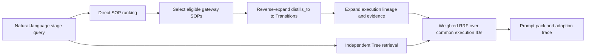

# Stage-Aware SOP Gateway + Hyperbolic RunForest Research Note

> Baseline: `99b457c0`  
> Status at baseline: design only; `run_forest_stage_hybrid` is not implemented.

## One-Sentence Goal

Build a stage-aware memory router in which SOPs serve as semantic road signs into an auditable RunForest of real execution paths, while preserving exact replay, leakage repair, and clean comparison controls.

## Mental Model

- **RunForest is the expedition map**: every real run, branch, success, failure, and local-best lineage.
- **Transition is a footprint**: the concrete parent-to-child change and its outcome.
- **SOP is a road sign**: a distilled method that points toward relevant footprints; it is not the terrain itself.
- **Evidence and FailurePattern are receipts and warnings**: metrics, errors, audit findings, and remediation context.
- **The Navigator reads them differently by stage**: Draft and Evolution read signs first; Improve and Debug inspect the map more heavily; every recommendation must still open its receipts and warnings.

## Current System: What Exists

The current `run_forest_agentic` path builds a heterogeneous graph containing `Run`, `RunNode`, `Transition`, `SOP`, `Evidence`, and `FailurePattern` records. A `distills_to` edge connects a Transition to an attached SOP. Runtime retrieval starts from RunForest/tree candidates and then carries attached SOPs into the returned pack.

The three initial draft roles already have distinct contracts:

| Role | Contract |
|---|---|
| `coldstart_baseline` | Use the original third-party cold-start template; inject no SOP or RunForest memory. |
| `memory_reproduction` | Perform exact replay or create a blocked repair seed; bypass ordinary/hybrid retrieval. |
| `novel_exploration` | Receive ordinary external memory and, after this plan is implemented, stage-aware hybrid memory. |

Additional initial drafts default to `novel_exploration`. Every child inherits its actual parent role.

For replay, a clean exact target may execute the stored code after provenance/hash checks. A known-problem source becomes `blocked_exact_source_repair_seed`: the source itself is not executed or ranked. A `mandatory_audit_repair` child inherits the frozen preservation contract, may change only leakage/evaluation protocol, and must pass a fresh leakage and preservation audit before GPU execution. Repair attempts remain FIFO, deduplicated, and limited to two.

## Current Geometry: What It Does Not Prove

RunForest coordinates are deterministic, not learned. The builder derives radius from depth and angle from leaf-span allocation. There is no embedding loss, gradient, or training procedure. Deep nodes can saturate near the ball boundary, and single-child chains or equivalent spans can produce duplicate or nearly duplicate coordinates.

The current offline evaluator often queries with a node's stored coordinate. Runtime does not possess that oracle coordinate: it constructs a pseudo-anchor from text direction plus heuristic radius/band prediction. This train/serve skew means an offline distance result does not directly prove the same mechanism helps an online Agent.

Therefore the current evidence can support only narrow statements about a deterministic tree layout and selected structural lookup tasks. It does not yet prove a learned hyperbolic embedding, general retrieval superiority, or downstream online improvement.

## Proposed Opt-In Mode

Add `run_forest_stage_hybrid` as an explicit mode. Existing `run_forest_agentic` behavior must remain unchanged. Only `novel_exploration` uses the hybrid path; baseline and replay continue to bypass it.

### Stage Routes And Quotas

The quota tuple is always **SOP candidates / selected gateways / independent Tree candidates**.

| Stage | Route | Quota | Rationale |
|---|---|---:|---|
| Draft | SOP-first | `6/3/2` | Begin with broad methods instead of copying one old path. |
| Improve | Tree-heavy | `4/2/6` | Prefer real metric-improving lineage and inspect its SOP explanation. |
| Debug | Tree-first | `2/1/8` | Search similar failures, fixes, and failed siblings first. |
| Evolution | SOP-first | `6/3/3` | Prefer reusable principles across branches/tasks. |
| Fusion | Balanced | `4/2/4` | Combine method-level and execution-level evidence. |

These quotas and fusion weights are explicit heuristics. They are not learned and must be evaluated rather than described as optimal.

## SOP Gateway Flow

1. Rank SOP cards directly using semantic text plus structured conditions, failures, stage, and evidence fields.
2. A formal gateway is a selected SOP with at least one code-audited clean supporting Transition/RunNode.
3. Reverse the real `Transition -> SOP` `distills_to` relation.
4. Expand supporting Transitions into parent, child, ancestors, local-best lineage, failed siblings, existing Evidence, and existing FailurePattern records.
5. Independently retrieve Tree execution candidates using the current RunForest logic.
6. Fuse the SOP-derived execution ranking and Tree-derived execution ranking over common execution IDs with weighted RRF (`k=60`). SOP card IDs are not fused directly with RunNode IDs.

When agentic gateway selection is enabled, exactly one structured LLM call chooses from eligible IDs and records reasons/goals. Returned IDs are validated. Invalid output, tool failure, or disabled agentic mode uses a transparent deterministic fallback.

## Safety And Candidate Classes

`leak_verified: true` is not sufficient by itself. Positive gateway support requires code-audited provenance and clean static/post-execution leakage disposition. Blocked, quarantined, or protocol-biased sources may appear only in `risk_warnings` or repair evidence, never as positive recommendations.

The three candidate classes are:

- `sop_transition_matches`: execution candidates reached through an eligible SOP gateway.
- `sop_only_candidates`: SOP cards without eligible execution support; useful only as unverified method references.
- `tree_only_candidates`: clean execution candidates reached only through independent Tree retrieval.

## Pack And Trace Contract

The new schema is `stage_hybrid_memory_pack_v1` with these required fields:

- `stage_route`
- `direct_sop_candidates`
- `selected_sop_gateways`
- `gateway_transitions`
- `tree_candidates`
- `sop_transition_matches`
- `sop_only_candidates`
- `tree_only_candidates`
- `evidence_refs`
- `failure_patterns`
- `risk_warnings`
- `navigation_trace`

Each navigation item records:

- `retrieval_channel`
- `candidate_class`
- `gateway_sop_id`
- `supporting_transition_ids`
- `selection_reason`
- `selection_state`: `candidate`, `selected`, `expanded`, or `injected`

Final adoption outcomes are separate from retrieval lifecycle state:

- `fully_adopted`
- `partially_adopted`
- `adopted_with_constraints`
- `rejected_after_inspection`
- `not_adopted`

Prompts must distinguish candidates, verified evidence, and risk warnings. A weak SOP-only reference must never be worded as a proven successful recipe.

## Held-Out Evaluation

Build natural-language queries from real journal contexts and group splits by run ID so variants from one run never cross dev/test. Test these concurrent controls:

1. No memory.
2. SOP-only.
3. Tree-only.
4. Naive SOP+Tree concatenation.
5. Stage-aware hybrid.
6. Flat-Twin hybrid: same graph, SOPs, coordinates, navigator, and scorer; only Poincare distance becomes Euclidean distance.
7. Independently built Euclidean memory with its own flat coordinates.

Core metrics:

- Gateway Recall@K and MRR.
- Supporting-Transition Recall@K.
- Local-best and debug-path recall.
- Evidence precision.
- Blocked exposure and positive-adoption rate.
- Retrieval latency and token cost.
- Adoption precision.
- Downstream task metric and convergence speed.
- NDCG as a supplementary ranking metric.

### Claim Gates

A stage-aware retrieval claim requires all of the following:

- Hybrid is at least as good as the best single channel for the relevant stage.
- Paired bootstrap gives `p < 0.05` for the claimed improvement.
- Blocked positive adoption is zero.
- Evidence/leakage precision does not decline.
- Concurrent online controls show a downstream win.

A hyperbolic-geometry claim additionally requires beating both Flat-Twin and independently built Euclidean memory. If semantic improvements raise all systems but Poincare does not beat those controls, the valid conclusion is better representation, not proven hyperbolic benefit.

## Novelty Position

Individual ingredients are not novel:

- [Poincare Embeddings](https://arxiv.org/abs/1705.08039)
- [HyperbolicRAG](https://arxiv.org/abs/2511.18808)
- [HyRAG](https://arxiv.org/abs/2606.03307)
- [MemORAI](https://aclanthology.org/2026.findings-acl.1408/)
- [GAM](https://aclanthology.org/2026.acl-long.1600/)
- [A-MEM](https://arxiv.org/abs/2502.12110)
- [HippoRAG](https://arxiv.org/abs/2405.14831)
- [PRAXIS](https://openreview.net/forum?id=MKG4BaSieN)
- [H-EPM](https://openreview.net/forum?id=PJ0GpmFYrR)
- [Memp](https://openreview.net/forum?id=aaij11qBCl)
- [Voyager](https://arxiv.org/abs/2305.16291)
- [Reflexion](https://arxiv.org/abs/2303.11366)

The strongest contribution candidate is the combination of:

1. Stage-conditioned heterogeneous memory routing.
2. SOP gateways into provenance-bearing execution lineage.
3. Audit-aware exact replay and leakage-only repair with model preservation.

This is a contribution hypothesis until the held-out and online gates pass.

## Safe And Unsupported Statements

Safe current statements:

- The graph stores execution lineage, distilled SOP attachments, evidence, and failure records.
- Coordinates are deterministic closed-form layout coordinates, not learned embeddings.
- The system has explicit baseline, reproduction, and exploration roles.
- Replay/leakage/preservation gates exist, while provenance certification still requires stronger runtime evidence.

Unsupported until experiments pass:

- Stage-aware hybrid retrieval improves downstream task performance.
- RRF is better than naive concatenation.
- Tree-first Debug or SOP-first Draft is optimal.
- Poincare distance is better than Flat-Twin or independent Euclidean memory.
- The memory system prevents all leakage or guarantees clean reuse.

## Implementation And Audit Checklist

### Core Routing

- [ ] Add opt-in `run_forest_stage_hybrid`; preserve old mode constructor and output behavior.
- [ ] Enforce exact stage quotas and explicit heuristic weights.
- [ ] Preserve role order, extra-draft default, child inheritance, and baseline/replay bypass.
- [ ] Build the reverse `distills_to` SOP-to-Transition index from the real graph schema.
- [ ] Implement field-aware SOP ranking and independent Tree retrieval.
- [ ] Implement one-call gateway selection, ID validation, and deterministic fallback.
- [ ] Expand lineage/evidence conservatively; never invent missing records.
- [ ] Fuse common execution IDs with weighted RRF (`k=60`).
- [ ] Keep blocked/quarantined/protocol-biased sources warning-only.

### Prompt And Adoption

- [ ] Produce all `stage_hybrid_memory_pack_v1` fields.
- [ ] Record structured candidate lifecycle trace.
- [ ] Pass role contract and candidate/evidence/risk wording through Draft, Improve, Debug, Evolution, and Fusion prompts.
- [ ] Record final adoption outcomes without labeling partial use as exact replay.

### Evaluation

- [ ] Build run-grouped held-out natural-language benchmark.
- [ ] Implement all seven controls and stage-specific metrics.
- [ ] Implement paired-bootstrap gates and geometry-specific controls.
- [ ] Generate a readiness report that allows or rejects each claim explicitly.

### Non-Regression And Preflight

- [ ] Test exact role order and routing/bypass behavior.
- [ ] Test real `distills_to` reverse expansion.
- [ ] Test gateway eligibility, one-call selection, invalid-ID fallback, and zero-eligible fail-closed behavior.
- [ ] Test blocked/quarantine/protocol warning-only behavior.
- [ ] Test common-ID RRF ordering and tie determinism.
- [ ] Test pack classes, trace fields, prompt wording, and adoption outcomes.
- [ ] Re-run exact replay, leakage repair, preservation contract, FIFO deduplication, and max-two-attempt tests.
- [ ] Run `py_compile`, focused unit tests, the RunForest suite, and a no-GPU preflight smoke.
- [ ] Run concurrent online controls before making a downstream or geometry claim.

The implementation is complete only when every applicable checkbox has direct code/test/report evidence. A passing narrow unit test cannot substitute for a missing held-out or online result.
