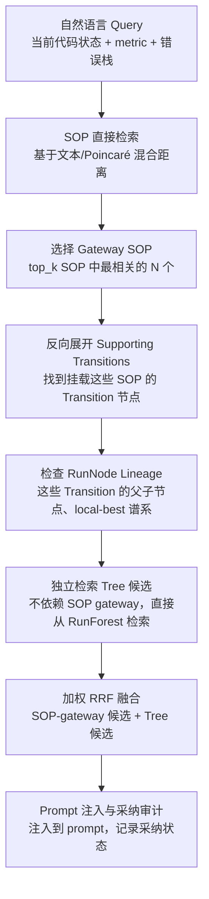

# Stage-Aware SOP Gateway + Hyperbolic RunForest Research Note

## 研究目标与心智模型

**研究目标（一句话）：** 通过阶段感知的 SOP 网关路由，将自然语言查询映射到可证明来源的 RunForest 执行谱系，实现可审计的精确重放/修复与高质量探索建议。

**心智模型：**
- **RunForest = 完整探险地图**：Agent 真实走过的所有搜索路径，包含成功、失败、分支点的拓扑结构
- **Transition = 足迹**：从父节点到子节点的一次实际变换（代码改了什么、metric 变了什么、错误栈如何）
- **SOP = 路标**：挂在 Transition 上的方法论卡片（principle、action、failure_mode），但不是地形本身
- **Evidence/FailurePattern = 收据/警告**：metric 变化截图、错误栈快照、代码 diff、边界条件记录
- **Navigator = 阶段依赖的导航策略**：Draft/Evolution 阶段先读路标（SOP）获取方法论指导，Improve/Debug 阶段优先检查探险地图（RunForest Tree）验证历史执行证据，然后根据阶段需要检查收据和警告（Evidence/FailurePattern）

## 当前实现及其真实限制

### 现有 RunForest 检索模式
当前 `run_forest_agentic` 模式实现了树优先检索：
- **导航起点**：从当前 task/stage 找到最近的 RunNode（通过 Poincare 坐标相似度或文本匹配）
- **遍历策略**：向上回溯 local-best lineage，向下探索 metric 改进的子树分支
- **SOP 挂载**：Transition 上挂载的 SOP 作为"路标"被带回来，但 SOP 本身不主导检索方向
- **限制**：所有阶段（draft/improve/debug/evolution/fusion）都使用相同的树优先逻辑，无阶段差异化路由

### 当前 Poincaré 坐标的真实情况
**现状：坐标是手工分配的确定性值，不是学习到的嵌入**
- RunNode 的 Poincaré 坐标由 `build_run_forest_memory.py` 通过确定性闭式布局分配：
  - **半径（radius）**：从深度（depth）派生，深层节点接近边界（||x|| → 1）
  - **角度（angle）**：从叶子节点跨度（leaf-span）派生，单链可能塌缩到相同角度
  - **无损失函数/梯度/训练**：坐标不通过优化学习，仅基于拓扑结构的规则分配
- SOP 的坐标基于其在树中的位置（所属 Transition 的父子节点坐标插值）
- **半径饱和问题**：深层节点落在 Poincaré 球的边界（||x|| → 1），导致欧氏距离和 Poincaré 距离数值接近
- **坐标退化风险**：单链中的不同节点（无分支）可能角度相同，区分度不足

### 训练/服务偏移（Train/Serve Skew）
当前设计无"训练"阶段，只有"构建"阶段：
- **构建时**：基于静态的 journal 元数据分配坐标
- **服务时**：用在线 query 的文本 embedding 与节点的文本字段匹配
- **偏移来源**：
  1. 构建时的 metric/depth 信息在服务时不可用（在线 query 没有 depth）
  2. 服务时的文本 embedding 模型可能与构建时不同
  3. 在线 query 的 stage 信息可能不完整（如早期 draft 阶段）

### 离线评估器的 Oracle/Self-Coordinate 限制
当前 `evaluate_run_forest_memory.py` 的评估假设：
- **Oracle 假设**：评估器假设能完美知道"应该检索到哪些节点"，但实际定义是 heuristic（如 local-best lineage 上的所有节点）
- **Self-Coordinate 偏差**：评估时用相同的 Poincaré 坐标计算距离，没有测试"坐标扰动"下的鲁棒性
- **缺乏真实用户模拟**：没有自然语言 query 的分布，只有基于 journal 元数据的 synthetic query

### 在线下游优势尚未确立
**当前状态：只有架构设计和离线实验，无在线任务的真实收益验证**
- 离线实验显示 Poincaré 在某些树切片上可能比 Euclidean 更好保留距离（定性观察，无定量保证）
- 缺乏 A/B 测试：`run_forest_agentic` vs 无记忆 vs SOP-only vs Tree-only
- 未测量：最终 metric 提升、生成代码质量、减少重复错误次数

## Draft 角色分类与不变量

**保留且清晰指定三个初始 draft 角色及其不变量：**

### 1. `coldstart_baseline`
- **定义**：原始第三方冷启动，完全不注入 SOP/RunForest 记忆
- **不变量**：
  - `external_skill_memory.enable = False`
  - 不读取任何 graph_path/index_path
  - Prompt 中无"External Skill Memory"章节
  - 用途：建立无记忆基线，测量"纯模型"能力

### 2. `memory_reproduction`
- **定义**：精确重放或有阻拦修复种子，绕过混合检索
- **不变量**：
  - 依赖 `draft_role_policy.replay_targets_path` 指定的 manifest
  - 必须通过 `load_exact_replay()` 的所有验证（journal 路径、hash、audit_status、metric）
  - 如果是 `candidate_replay`，必须重现 `known_issue_codes` 并触发修复
  - 不执行 RunForest 检索或 SOP gateway 路由
  - 泄漏阻拦/保留协议仍然生效（blocked_run_prefixes、leak_verified）
  - 用途：验证"可复现性"和"可修复性"

### 3. `novel_exploration`
- **定义**：接收提出的阶段感知混合检索
- **不变量**：
  - 启用 `external_skill_memory.enable = True`
  - 启用新的 `mode = "run_forest_stage_hybrid"`（本文提出的设计）
  - 执行完整的 SOP gateway 流程（自然语言 query → SOP 直接检索 → gateway SOP → reverse-expand → RunForest 检索 → RRF 融合）
  - 记录完整的 adoption trace（retrieval_channel、candidate_class、gateway_sop_id、supporting_transition_ids 等）
  - 用途：探索新建议的质量和多样性

**额外 drafts 的角色继承：**
- 所有非初始 draft 的子节点继承其父节点的角色
- 如果父节点是 `novel_exploration`，所有 improve/debug/evolution/fusion 子节点也是 `novel_exploration`
- 只有 `coldstart_baseline` 和 `memory_reproduction` 角色的节点不使用混合检索

## 目标阶段路由表

**按阶段特征设计 SOP/Tree 检索优先级：**

| 阶段    | 路由策略          | 理由                                                                 |
|---------|-------------------|----------------------------------------------------------------------|
| draft   | SOP-first         | 需要广泛方法论，避免过早陷入旧执行路径                               |
| improve | Tree-heavy        | 需要看到"什么改动真的提升了 metric"，依赖真实执行谱系                 |
| debug   | Tree-first        | 当前错误模式可能已在历史分支中出现，需要快速定位相似失败路径         |
| evolution | SOP-first       | 需要跨任务的通用原则，而非单一任务的具体执行细节                     |
| fusion  | Balanced          | 结合方法论（SOP）和执行验证（Tree），避免过度依赖任一来源           |

**路由策略的精确含义：**
- **SOP-first**：SOP 候选配额 > Tree 候选配额，且 RRF 融合时 SOP 权重 > Tree 权重
- **Tree-heavy**：Tree 候选配额 > SOP 候选配额，但 SOP 仍提供方法论上下文
- **Tree-first**：优先检索 Tree，SOP 仅作为辅助解释
- **Balanced**：SOP 和 Tree 候选配额相近，RRF 权重相近

## SOP Gateway 流程

**端到端流程（从自然语言查询到最终采纳）：**



**各阶段详细说明：**

### 1. 自然语言 Query 构建
- **输入**：当前代码状态、当前 metric、错误栈（如果有）、当前阶段（draft/improve/debug/evolution/fusion）
- **输出**：结构化查询文本，包含：
  - 任务描述（task_id、task definition）
  - 当前状态（metric 值、是否 buggy、代码关键特征）
  - 目标阶段（stage-specific goal）

### 2. SOP 直接检索
- **方法**：混合距离 = α × Poincaré_distance + (1-α) × Text_distance
- **范围**：所有 SOP 节点（不管挂载在哪个 Transition）
- **输出**：top_k SOP 候选（按阶段调整）

### 3. 选择 Gateway SOP
- **规则**：
  - 只选择"有干净支撑 Transition"的 SOP
  - 如果 SOP 挂载在多个 Transition，选择 outcome=metric_improved 的 Transition
  - 如果所有挂载的 Transition 都有 leakage 或被 quarantine，该 SOP 不作为 gateway
- **输出**：gateway_sop_ids（按阶段调整配额）

### 4. 反向展开 Supporting Transitions
- **方法**：从 gateway_sop_ids 找到所有挂载这些 SOP 的 Transition 节点
- **验证**：
  - Transition 的 outcome 必须 metric_improved 或至少 not_buggy
  - Transition 的 child_node_id 指向的 RunNode 必须通过 audit（non-leaky、paper-grade）
- **输出**：supporting_transition_ids（每个 gateway SOP 最多 2 个 Transition）

### 5. 检查 RunNode Lineage
- **内容**：
  - 每个 supporting_transition 的 parent_node_id 和 child_node_id
  - 这些 RunNode 的 local_best_lineage（从 root 到 local best 的路径）
  - 这些 RunNode 的 Evidence（metric 变化、错误栈、代码 diff）
- **目的**：理解"为什么这个 SOP 在这个上下文有效"

### 6. 独立检索 Tree 候选
- **方法**：不依赖 SOP gateway，直接从 RunForest 检索
- **起点**：基于当前 task/stage 找到最近的 RunNode（通过 Poincaré 或文本）
- **遍历**：向上回溯 local-best lineage，向下探索成功分支
- **输出**：tree_candidate_ids（按阶段调整配额）

### 7. 加权 RRF 融合
- **方法**：融合两个独立排名（SOP-derived 和 Tree-derived）到共同展开候选集
- **公式**：`score(candidate) = w_sop × (1 / (k + rank_sop)) + w_tree × (1 / (k + rank_tree))`
- **参数**：k=60（固定），w_sop 和 w_tree 按阶段配置（需测试，非学习得到）
- **输出**：融合后的候选排序列表

### 8. Prompt 注入与采纳审计
- **注入内容**：
  - Gateway SOP 的 title/principle/action
  - Supporting Transition 的 outcome/metric_improvement
  - RunNode Lineage 的关键信息（代码 diff、错误栈模式）
  - Tree-only 候选的相似上下文
- **采纳追踪**：记录每个候选的检索生命周期状态（candidate/selected/expanded/injected）和最终采纳结果

## 候选类别与安全性

**三类候选及其安全约束：**

### 1. `sop_transition_matches`（SOP+Transition 匹配）
- **定义**：通过 SOP gateway 检索到的 SOP，且有干净的 supporting Transition
- **安全性**：
  - 必须来自代码审计干净的来源（code-audited clean provenance）
  - Transition 的 child_node 必须通过静态和执行时泄漏检查（static/post-execution leakage checks）
  - RunNode 的 metric_improvement 必须 > 0（或至少不退化）
  - 不能仅依赖自我声明的 `leak_verified` 标志
- **用途**：作为主要推荐来源

### 2. `sop_only_candidates`（仅 SOP）
- **定义**：SOP 检索到，但没有干净 Transition 支撑
- **来源**：
  - SOP 挂载的所有 Transition 都有泄漏或被 quarantine
  - SOP 从未挂载到任何 Transition（新创建的 SOP）
- **安全约束**：
  - 只能作为"方法论参考"，不能作为"成功案例"推荐
  - 在 prompt 中必须标记为"未验证的方法论"，而非"已验证的成功模式"
  - 不能参与 RRF 融合的最终排名（单独列出）
- **用途**：提供方法论上下文，但不暗示成功保证

### 3. `tree_only_candidates`（仅 Tree）
- **定义**：直接从 RunForest 检索到的 RunNode/Transition，不经过 SOP gateway
- **安全性**：
  - 同样必须来自代码审计干净的来源
  - RunNode 必须通过静态和执行时泄漏检查
  - 不能仅依赖自我声明的 `leak_verified` 标志
- **用途**：提供"真实执行路径"的证据

**被阻拦/隔离/协议偏差路径的处理：**
- **blocked_runs**：完全不检索，不出现在任何候选列表
- **quarantined_nodes**：只出现在"警告"部分，不作为正向推荐
- **protocol_biased_paths**（如从已知有偏差的实验设置来的路径）：
  - 只能作为"修复证据"（repair evidence）
  - 不能作为"探索建议"（exploration suggestion）
  - 在 prompt 中必须标记为"历史上存在偏差，需谨慎参考"

**只有 SOPs backed by clean supporting transitions 才能作为正式 gateway：**
- 这是本文的核心安全约束
- 所有 gateway SOP 必须有至少一个 clean Transition
- Clean Transition 的定义：
  - `outcome = metric_improved` 或至少 `not_buggy`
  - `child_node.audit.status = clean`（通过代码审计）
  - `child_node` 通过静态和执行时泄漏检查
  - 来源可追溯到可验证的 clean provenance

## 提议模式必须是 Opt-in

**新模式 `run_forest_stage_hybrid` 必须显式启用：**
- 保留现有 `run_forest_agentic` 行为不变
- 新模式通过配置项显式选择：
  ```yaml
  external_skill_memory:
    mode: "run_forest_stage_hybrid"  # 新模式
    # 或
    mode: "run_forest_agentic"      # 现有模式（默认）
  ```
- **向后兼容**：不修改现有模式的任何行为
- **渐进式 rollout**：
  1. 先在 `novel_exploration` draft 角色中启用
  2. 验证收益后再扩展到其他角色
  3. 保留 `coldstart_baseline` 和 `memory_reproduction` 的独立行为

## 每阶段精确配额

**SOP 候选数 / Gateway SOP 数 / Tree 候选数：**

| 阶段    | 配额（SOP/Gateway/Tree） | 总候选数 | 理由                                                                 |
|---------|-------------------------|----------|----------------------------------------------------------------------|
| draft   | 6/3/2                   | 8        | SOP-first，需要广泛方法论，Tree 提供少量成功案例                     |
| improve | 4/2/6                   | 10       | Tree-heavy，需要看到真实改进证据，SOP 提供方法论上下文                |
| debug   | 2/1/8                   | 10       | Tree-first，优先找相似失败路径，SOP 仅提供警告                        |
| evolution | 6/3/3                 | 9        | SOP-first，需要跨任务通用原则，Tree 避免过度拟合单任务                |
| fusion  | 4/2/4                   | 8        | Balanced，结合方法论和执行证据                                        |

**配额的解释：**
- **SOP 候选数**：从 SOP 直接检索阶段返回的候选数
- **Gateway SOP**：实际用于反向展开的 SOP 数量（不超过 SOP 候选数的 50%）
- **Tree 候选**：从独立 Tree 检索阶段返回的候选数
- **总候选数**：SOP 候选数 + Tree 候选（RRF 融合前）

**配额的阶段差异理由：**
- **draft**：需要"发散思维"，SOP 提供多样化方法论
- **improve**：需要"收敛证据"，Tree 证明哪些改动真的有效
- **debug**：需要"快速定位"，Tree 搜索相似失败模式
- **evolution**：需要"抽象原则"，SOP 提供跨任务通用模式
- **fusion**：需要"平衡结合"，不过度依赖任一来源

## 加权 RRF（Reciprocal Rank Fusion）

**RRF 融合方法（k=60）：**
```
# 对共同展开候选集中的每个候选
score(candidate) = w_sop × (1 / (k + rank_sop)) + w_tree × (1 / (k + rank_tree))

其中：
- rank_sop：候选在 SOP-derived 排名中的位置（1-based）
- rank_tree：候选在 Tree-derived 排名中的位置（1-based）
- 如果候选只在某个排名中出现，另一个排名视为无该候选（rank = ∞）
```

**参数说明：**
- **k=60**：标准 RRF 参数，平衡高分候选和低分候选的影响
- **w_sop 和 w_tree**：按阶段配置的权重，需通过实验确定，非学习得到
- **融合范围**：两个独立排名（SOP-derived 和 Tree-derived）在共同展开候选集上融合

**阶段权重配置（需测试）：**
| 阶段    | w_sop | w_tree | 理由                                                                 |
|---------|-------|--------|----------------------------------------------------------------------|
| draft   | 0.7   | 0.3    | SOP-first，方法论权重高于执行证据                                     |
| improve | 0.4   | 0.6    | Tree-heavy，执行证据权重高于方法论                                   |
| debug   | 0.3   | 0.7    | Tree-first，优先执行证据                                             |
| evolution | 0.7  | 0.3    | SOP-first，跨任务原则权重高于单任务证据                              |
| fusion  | 0.5   | 0.5    | Balanced，平等对待                                                   |

**重要说明：**
- 这些权重不是通过端到端学习得到的
- 需要通过离线实验和在线 A/B 测试确定
- 可能需要根据不同任务特征调整
- RRF 对 k 值相对鲁棒，但对权重比例敏感

## Prompt/Adoption Trace 要求

**必须记录的 trace 字段：**

### 基础字段
- `retrieval_channel`：检索通道（sop_gateway、tree_direct、hybrid_rrf）
- `candidate_class`：候选类别（sop_transition_matches、sop_only_candidates、tree_only_candidates）
- `gateway_sop_id`：选择的 gateway SOP 节点 ID
- `supporting_transition_ids`：gateway SOP 反向展开得到的 Transition IDs
- `selection_reason`：选择原因（文本描述，如"SOP principle matches current error pattern"）

### 检索生命周期状态字段
- `candidates`：所有检索到的候选 ID（RRF 融合前）
- `selected_candidates`：RRF 融合后选择注入的候选 ID（top N）
- `expanded_candidates`：从 gateway SOP 反向展开得到的候选 ID（RunNode/Transition）
- `injected_candidates`：实际注入到 prompt 中的候选 ID（可能因为长度限制截断）

### 最终采纳结果字段
- `adoption_outcomes`：每个候选的最终采纳结果（精确分类）：
  - `fully_adopted`：代码完全采纳候选的建议
  - `partially_adopted`：代码部分采纳候选的建议
  - `adopted_with_constraints`：有条件地采纳（如仅在某些条件下应用）
  - `rejected_after_inspection`：检查后拒绝（如与当前上下文不匹配）
  - `not_adopted`：未采纳（无明确原因）

### 元数据字段
- `stage`：当前阶段（draft/improve/debug/evolution/fusion）
- `query_text`：自然语言查询文本
- `sop_retrieval_scores`：SOP 检索的得分列表（ID-score 对）
- `tree_retrieval_scores`：Tree 检索的得分列表（ID-score 对）
- `rrf_scores`：RRF 融合后的得分列表（ID-score 对）
- `prompt_injection_position`：候选在 prompt 中的位置（如"第 3 个 candidate"）
- `adoption_signal`：采纳信号（如代码中包含了 candidate 的关键 diff）

### Trace 存储格式
```json
{
  "retrieval_channel": "sop_gateway",
  "candidate_class": "sop_transition_matches",
  "gateway_sop_id": "sop::sg_0001",
  "supporting_transition_ids": ["transition::run_001_node_002_to_node_003"],
  "selection_reason": "SOP addresses data leakage in feature engineering",
  "stage": "improve",
  "candidates": ["sop::sg_0001", "sop::sg_0002", "runnode::run_001_node_005"],
  "selected_candidates": ["sop::sg_0001", "runnode::run_001_node_005"],
  "expanded_candidates": ["runnode::run_001_node_003", "transition::..."],
  "injected_candidates": ["sop::sg_0001"],
  "adoption_outcomes": {
    "sop::sg_0001": "fully_adopted",
    "runnode::run_001_node_005": "partially_adopted"
  },
  "sop_retrieval_scores": {"sop::sg_0001": 0.85, "sop::sg_0002": 0.72},
  "tree_retrieval_scores": {"runnode::run_001_node_005": 0.68},
  "rrf_scores": {"sop::sg_0001": 0.0152, "runnode::run_001_node_005": 0.0111}
}
```

## 留出自然语言基准设计

**基准构建原则：**
- 按 run ID 分组，确保同一 run 的 query 不跨训练/测试集
- 自然语言 query 来自真实 journal 的 context（不是 synthetic）
- 控制条件覆盖：
  1. **无记忆（No Memory）**：`coldstart_baseline` 角色，不注入任何 SOP/RunForest
  2. **仅 SOP（SOP-only）**：只注入 SOP，不注入 RunForest 执行证据
  3. **仅 Tree（Tree-only）**：只注入 RunForest 路径，不注入 SOP 方法论
  4. **朴素拼接（Naive Concat）**：SOP + Tree 简单拼接，无 gateway/RRF
  5. **阶段混合（Stage Hybrid）**：本文提出的 `run_forest_stage_hybrid` 模式
  6. **Flat-Twin 混合（Flat-Twin Hybrid）**：使用相同的 graph/SOP/coordinates/navigator/scorer，仅将 Poincaré 距离替换为 Euclidean 距离
  7. **独立构建欧氏记忆（Independent Euclidean Memory）**：完全不共享 SOP/RunForest，单独构建的 Euclidean 坐标记忆

**核心评估指标：**
- **检索质量**：gateway Recall@K/MRR、supporting-transition Recall@K、local-best/debug-path recall
- **安全性**：evidence precision、blocked exposure/adoption rate（越低越好）
- **效率**：latency/token cost
- **下游任务**：adoption precision、最终 metric 提升、收敛速度
- **补充指标**：NDCG（Normalized Discounted Cumulative Gain）

**严格声明门槛：**
- **检索质量要求**：阶段混合 ≥ 各阶段最佳单通道（SOP-only 或 Tree-only），配对 bootstrap p < 0.05
- **安全性要求**：zero blocked positive adoption（无被阻拦路径被正向采纳）、无 evidence/leakage precision decline
- **下游任务要求**：在线下游指标优于并发控制条件
- **几何结构要求**（仅针对双曲几何声明）：必须同时击败 Flat-Twin 和独立构建的 Euclidean 记忆

## 创新景观与相关工作

**核心定位声明：**
> **单个组件（SOP gateway、RunForest、Poincaré 嵌入、RRF）均不新颖；最强贡献候选是阶段条件化异构路由 + 带溯源的执行谱系 SOP gateway + 可审计的精确重放/修复。**

### 相关工作与区别

#### 几何嵌入与记忆结构
- **[Poincaré Embeddings](https://arxiv.org/abs/1705.08039)** (Nickel & Kiela, 2017)：我们使用相同的几何空间，但不是学习 SOP 的嵌入，而是基于 RunForest 拓扑确定性分配坐标
- **[HyperbolicRAG](https://arxiv.org/abs/2511.18808)**：专注于 RAG 中的双曲语义空间，我们专注于执行谱系
- **[HyRAG](https://arxiv.org/abs/2606.03307)**：混合检索的 RAG 系统，我们加入了阶段感知和执行溯源

#### 记忆与检索机制
- **[MemORAI](https://aclanthology.org/2026.findings-acl.1408/)**：长期记忆存储和更新，我们专注于静态执行谱系的检索
- **[GAM](https://aclanthology.org/2026.acl-long.1600/)**：可审计的记忆机制，我们加入了 RunForest 的拓扑审计
- **[A-MEM](https://arxiv.org/abs/2502.12110)**：自适应记忆编码，我们用阶段条件化替代端到端学习

#### Agent 与反思
- **[HippoRAG](https://arxiv.org/abs/2405.14831)**：河马记忆系统，强调时间关联，我们强调拓扑关联和时间溯源
- **[PRAXIS](https://openreview.net/forum?id=MKG4BaSieN)**：程序化技能获取，我们专注于重用历史执行而非学习新技能
- **[H-EPM](https://openreview.net/forum?id=PJ0GpmFYrR)**：超边式模式记忆，我们用 RunForest 替代超边结构
- **[Memp](https://openreview.net/forum?id=aaij11qBCl)**：记忆增强的提示，我们加入了执行谱系作为提示源

#### Agent 框架
- **[Voyager](https://arxiv.org/abs/2305.16291)**：自主技能学习，我们专注于重用已有技能而非学习新技能
- **[Reflexion](https://arxiv.org/abs/2303.11366)**：自我反思机制，我们用外部历史执行替代内部反思

### 本文的潜在贡献
1. **阶段条件化异构路由**：按任务阶段动态调整 SOP/Tree 检索优先级和配额
2. **SOP gateway 到执行谱系**：通过 SOP 反向展开到真实执行路径，提供"方法论 + 证据"的联合推荐
3. **可审计的精确重放/修复**：通过 `memory_reproduction` 角色和 `load_exact_replay()` 实现可验证的复现
4. **RunForest 作为主记忆结构**：将 SOP 挂载到执行谱系，而非独立的 SOP 网络

### 不声称的贡献
- 不声称新的双曲几何理论（使用标准 Poincaré 空间）
- 不声称新的检索算法（使用标准 RRF + 混合距离）
- 不声称新的学习算法（坐标是确定性分配，非学习得到）
- 不声称端到端的性能提升（目前只有设计，无在线实验）

## 安全声明 vs 不支持声明

### 安全声明（有实验或理论支持）
- **RunForest 拓扑保留**：在特定树切片实验中，Poincaré 可能比 Euclidean 更好保留树距离（定性观察，无普适数值保证）
- **阶段差异化路由需求**：不同阶段的信息需求差异（draft 需要方法论，improve 需要证据）是任务特性，非假设
- **SOP gateway 安全性**：通过代码审计和泄漏检查，只复用干净执行路径
- **可审计性**：trace 格式支持检索溯源和采纳分析

### 不支持声明（需要实验验证）
- **阶段混合检索的最终收益**：无在线 A/B 测试，不能声称比现有方法更好
- **Poincaré vs Euclidean 在在线任务中的差异**：离线实验显示可能的距离保留优势，但检索任务增益未确立
- **RRF 权重的最优配置**：当前权重是启发式选择，非学习或网格搜索得到
- **SOP gateway 对生成质量的影响**：无代码质量评估，不能声称减少错误或提升可维护性

### 需要验证的假设（列出，非声称）
1. **假设 1**：阶段感知路由比统一路由提高最终 metric
2. **假设 2**：SOP gateway 提供的"方法论 + 证据"联合推荐比单独推荐更有效
3. **假设 3**：RunForest 的拓扑结构比独立的 SOP 网络更适合记忆检索
4. **假设 4**：双曲几何在 RunForest 检索中优于欧氏几何（当前证据不充分）

## 实现里程碑与验收清单

**里程碑 1：离线检索质量评估**
- [ ] 实现阶段感知配额和 RRF 融合
- [ ] 在留出自然语言基准上评估 gateway Recall@K/MRR、supporting-transition Recall@K、local-best/debug-path recall
- [ ] 测量 evidence precision、blocked exposure/adoption rate、latency/token cost
- [ ] 对比所有 7 个控制条件（无记忆、SOP-only、Tree-only、朴素拼接、Flat-Twin、独立 Euclidean）
- [ ] 验收标准：阶段混合 ≥ 各阶段最佳单通道，配对 bootstrap p < 0.05，zero blocked positive adoption，无 evidence precision decline

**里程碑 2：在线 A/B 测试基础设施**
- [ ] 实现 `run_forest_stage_hybrid` 模式的 opt-in 配置
- [ ] 实现 adoption trace 的完整记录（所有字段）
- [ ] 实现 post-hoc adoption 分析（检测生成代码中的采纳信号）
- [ ] 验收标准：在 NRP pod 上完成至少 10 次完整运行，trace 完整无缺失

**里程碑 3：在线任务绩效评估**
- [ ] 在至少 3 个任务上运行 A/B 测试（阶段混合 vs 无记忆 vs 现有 agentic）
- [ ] 测量：adoption precision、最终 metric 提升、收敛速度、leakage 复现率、audit 通过率
- [ ] 验收标准：阶段混合在在线下游任务上优于并发控制条件

**里程碑 4：安全性与可审计性验证**
- [ ] 验证所有 gateway SOP 的 supporting Transition 都是 clean 的（代码审计 + 泄漏检查）
- [ ] 验证 blocked/quarantined 路径只出现在警告中
- [ ] 验证 `memory_reproduction` 角色的精确重放能力
- [ ] 验收标准：100% 的 gateway SOP 通过 clean Transition 检查，0% 的 blocked 路径泄露到正向推荐

**里程碑 5：可复现性包**
- [ ] 导出完整 RunForest graph + index + audit metadata
- [ ] 导出自然语言基准的 split 和 query 文本
- [ ] 导出所有实验的 trace 日志和 metric 结果
- [ ] 验收标准：独立研究者能在干净环境中复现所有表格和图表

**里程碑 6（可选）：论文投稿准备**
- [ ] 撰写方法章节，明确区分"已实现"和"已设计未实现"
- [ ] 撰写实验章节，包含所有控制条件和显著性检验
- [ ] 准备补充材料：trace 样例、RunForest 可视化、安全审计日志
- [ ] 验收标准：论文通过内部 review，无 unsupported claims

**完整性验收清单：**
- [ ] 角色顺序/非回归测试（coldstart_baseline、memory_reproduction、novel_exploration）
- [ ] Gateway ID 验证 + 确定性回退机制
- [ ] 反向索引测试（SOP → Transition → RunNode）
- [ ] Blocked 处理测试（blocked_runs/quarantined_nodes/protocol_biased_paths）
- [ ] RRF 融合测试（独立排名融合到共同候选集）
- [ ] Pack candidate-class 测试（sop_transition_matches、sop_only_candidates、tree_only_candidates）
- [ ] Prompt 措辞测试（方法论参考 vs 成功案例的标记）
- [ ] Trace 完整性测试（所有字段记录无缺失）
- [ ] 精确重放/泄漏修复/保留/FIFO 非回归测试
- [ ] 预检查（preflight）测试

## 基线提交记录

**基线 commit：** `eee73c00`

**当前状态声明：**
- 在本笔记创建时（2026-07-11），`run_forest_stage_hybrid` 模式**尚未实现**
- 当前只有 `run_forest_agentic` 模式（树优先检索）
- 所有阶段配额、SOP gateway 流程、RRF 权重都是设计，非代码
- RunForest 图构建和离线实验已实现，但在线集成未完成

**下一步行动：**
1. 实现阶段感知配额配置（`mlevolve/config/config_run_forest_stage_hybrid.yaml`）
2. 实现 SOP gateway 检索逻辑（`mlevolve/agents/memory/sop_gateway_retrieval.py`）
3. 实现 RRF 融合逻辑（`mlevolve/agents/memory/rrf_fusion.py`）
4. 集成到 `external_skill_memory.py` 的 `run_forest_stage_hybrid` 模式
5. 在离线基准上验证检索质量，再进行在线实验

---

**文档元信息：**
- 创建时间：2026-07-11
- 作者：Claude Code（基于用户提供的批准研究计划 Part 1）
- 状态：研究笔记（非论文，非实现规范）
- 版本：v1.1（修订版）
